# AstroOS — The Complete Master Blueprint & Architectural Vision

> **"Bridging High-Precision Siddhantic Astronomy, Classical Parashari Phalita, and Strict Empirical Statistical Governance."**

---

## 1. What is AstroOS? (The Core Vision & "Funda")

पारंपरिक ज्योतिष सॉफ्टवेयरों में 3 बड़ी खामियां हैं:
1. **गणित और खगोलशास्त्र के शॉर्टकट्स:** मनमाना अयनांश, राशि और भावचलित को मिला देना (Conflation), अधिक मास की पहली युति छोड़ देना।
2. **अवैज्ञानिक और फर्जी दावे:** तुक्के की भविष्यवाणियों पर तालियां बजाना और कभी भी किसी वास्तविक डेटासेट (Out-of-Sample Validation) पर सटीकता न नापना।
3. **AI का भ्रम (Hallucination):** जेनेरिक AI (ChatGPT/Claude) बिना किसी नियम के वेस्टर्न, केपी, भृगु और पराशरी को मिलाकर मनगढ़ंत प्रेडिक्शन देता है।

### AstroOS का मूल उद्देश्य (The Mission):
**AstroOS विश्व का पहला "Rigorous, Mathematically Verified, Empirically Grounded Astrological Operating System" है।**
यह केवल एक कुंडली सॉफ्टवेयर नहीं है; यह एक **Computational Intelligence Engine** है जो:
- **100% शुद्ध गणित और खगोलशास्त्र (Siddhantic Ephemeris)** पर चलता है।
- **पं. विनय झा (Vinay Jha) के 10-स्टेप शास्त्रीय फलित सिद्धांत** को मल्टी-एजेंट और मिक्चर-ऑफ-एक्सपर्ट्स (MoE) आर्किटेक्चर में कोडिफाई करता है।
- **वैज्ञानिक डेटा साइंस (Grouped Walk-Forward, ROC-AUC, Brier Score, Zero Mock Data)** से अपनी हर प्रेडिक्शन को बैकटेस्ट और वैलिडेट करता है।

---

## 2. AstroOS के 4 मुख्य पिलर्स (The 4 Architectural Pillars)

```mermaid
graph TD
    A[AstroOS Core Engine] --> B[Pillar 1: Mathematical & Siddhantic Engine]
    A --> C[Pillar 2: Phalita MoE & Shastric Reasoning]
    A --> D[Pillar 3: Empirical Benchmarking & Validation]
    A --> E[Pillar 4: Medini Mundane & Macro Intelligence]

    B --> B1[Shri Surya Siddhanta / Lahiri Ephemeris]
    B --> B2[D1-D60 Divisionals & SSS Bhavachalita]
    B --> B3[5-Level Vimshottari for D1 & Divisionals]
    B --> B4[Log-2 Main Strength & Shadbala Tiebreaker]

    C --> C1[10-Step Jha Synthesis Pipeline]
    C --> C2[Bhavottama & Arudha Lagna vs D1 Reality]
    C --> C3[Transit + Ashtakavarga Rekha Trigger Gate]
    C --> C4[7-Chara Karakas & Karakamsha Lagna]

    D --> D1[Zero Mock Data Invariant]
    D --> D2[Grouped Chronological Walk-Forward]
    D --> D3[Statistical Calibration: ROC-AUC, PR-AUC, Brier Skill]
    D --> D4[Rodden-Verified Public Research Archive AA/A]

    E --> E1[Chaitra Shukla Pratipada & Nava Nayakas]
    E --> E2[Cardinal Solar Ingresses Mesha/Karka/Tula/Makara]
    E --> E3[Kurma Chakra 9-Sector Geopolitics]
    E --> E4[Rainfall & Commodity Price Forecasting]
```

---

## 3. Pillar 1: Astronomical & Siddhantic Precision (खगोल और गणित)

AstroOS के 40+ कोर मॉड्यूल्स **FROZEN** हैं और PyJHora/BPHS के साथ वेरीफाइड हैं:

1. **Rasi Chart $\neq$ Bhavachalita (Non-Negotiable):**
   - **Rasi Chart:** सिर्फ गणितीय गणनाओं (ग्रह-दृष्टि, उच्च/नीच, वर्ग निर्माण) के लिए।
   - **D1 SSS Bhavachalita:** सभी 12 भावों के फल, भाव स्वामियों के प्रभाव के लिए।
2. **Log-Base-2 Main Strength (Dignity 1 to 9):**
   - लीनियर स्केलिंग के बजाय एक्सपोनेंशियल स्ट्रेंथ ($2^0$ से $2^8 = 1.0$ से $256.0$)।
   - Shadbala केवल तब इस्तेमाल होता है जब दो ग्रहों का Main Strength बिल्कुल समान हो (Tiebreaker Only)।
3. **5-Level Multi-Varga Vimshottari:**
   - D1 के लिए स्वतंत्र दशा और वर्ग कुंडलियों (D9, D10, D30) के लिए स्वतंत्र 5-लेवल दशा (MD-AD-PD-SD-PAD)।

---

## 4. Pillar 2: The Jha 10-Step Phalita MoE Engine (फलित प्रेडिक्शन इंजन)

यह इंजन किसी भी जीवन क्षेत्र (करियर, विवाह, स्वास्थ्य, संपत्ति) की भविष्यवाणी 10 सख्त शास्त्रीय चरणों में करता है:

1. **Step 1 — 3 Core Charts:** D1 Bhavachalita + रिलेवेंट वर्ग (D10/D9/D30) + Varsha Pravesha (VPC)।
2. **Step 2 — Dual Running Dashas:** D1 दशा + वर्ग दशा का स्वतंत्र मिलान।
3. **Step 3 — Log-2 Main Strength:** ग्रहों की वास्तविक शक्ति।
4. **Step 4 — Final Varga Strength:** $\text{Main Strength} \times \text{Vimshopaka Weight}$।
5. **Step 5 — Sudarshana Chakra:** लग्न + चंद्र + सूर्य लग्न का समन्वित विश्लेषण।
6. **Step 6 — Bhavottama Detection:** जब कोई ग्रह D1 और वर्ग में एक ही भाव (House) में हो (Kimshukadi Amplification)।
7. **Step 7 — Arudha Lagna (AL & UL):** दुनिया क्या देखती है (Perception) बनाम अंदरूनी सच्चाई (Natal Reality)।
8. **Step 8 — Transit + Ashtakavarga Triggers:** गोचर केवल घटना को *ट्रिगर* करता है, प्रॉमिस सिर्फ दशा और भाव करते हैं।
9. **Step 9 — Masa Pravesha Chakra (MPC):** वर्ष को महीने के सटीक समय में सिकोड़ना।
10. **Step 10 — Multi-Layer Confluence Scoring:** सभी लेयर्स का संयुक्तीकरण और कॉन्फिडेंस स्कोर।

---

## 5. Pillar 3: Empirical Statistical Governance (डेटा साइंस और सत्यापन)

AstroOS की सबसे बड़ी यूएसपी यह है कि **यह अपने दावों को डेटा से साबित करता है:**
- **Zero Mock Data:** कभी कोई डमी या फेक रिकॉर्ड्स नहीं।
- **Grouped Walk-Forward Validation:** कोई लुक-अहेड बायस या डेटा लीकेज नहीं।
- **Honest Statistical Reporting:** 
  - जब हेल्थ में सिग्नल नहीं मिला (`AUC 0.4823`), तो सिस्टम ने उसे छुपाने के बजाय `NO_SIGNAL` रिपोर्ट किया।
  - विसंगतियों को ठीक करने के लिए वैज्ञानिक कैलिब्रेशन और मल्टी-लेयर गेटिंग का उपयोग किया जाता है।

---

## 6. What We Have Built vs What We Need to Build (Roadmap)

| Phase / Milestone | Description | Status |
|---|---|---|
| **M1: Mathematical Engines** | Ephemeris, Divisional Charts (D1-D60), SSS Bhavachalita, Shadbala, Ashtakavarga, Dignities | ✅ **COMPLETED & FROZEN** |
| **M2: Medini & Mundane** | Chaitra Shukla Pratipada, Nava Nayakas, 4 Ingresses, Kurma Chakra, Eclipse Engine | ✅ **COMPLETED & FROZEN** |
| **M3: Special Systems** | Jaimini (7 Karakas, Upapada, Karakamsha, Shoola/Mandooka Dasha), Tajika (16 Yogas, Mudda Dasha), KP System | ✅ **COMPLETED & FROZEN** |
| **M4: Phalita MoE & OOS Benchmark** | 10-Step Jha Synthesis Pipeline, Softmax Router, Historical Backtest Harness, Multi-Domain OOS Benchmark | 🟡 **IN PROGRESS (Refining Math/Stats & Health Gate)** |
| **M5: AI Grounding & Epistemic Governance** | Hallucination Prevention Validator, Strict Citation Whitelist, Machine-Readable Rule IDs | ⏳ **NEXT STEP** |
| **M6: Production API & Full UI Experience** | Next.js Modern UI, Multi-Page Chart Sync, Interactive Research Studio, Office Add-ins & Mobile Apps | ⏳ **FUTURE MILESTONE** |

---

## 7. संक्षेप में (The Bottom Line)

हम एक ऐसा सिस्टम बना रहे हैं जो **ज्योतिष को अंधविश्वास, तुक्केबाजी और मनगढ़ंत नियमों से निकालकर एक गणितीय, पारदर्शी और वैज्ञानिक इंटेलिजेंस प्लेटफॉर्म (AstroOS)** बना दे — जिस पर कोई भी आम यूजर, रिसर्चर या स्कॉलर आंख बंद करके नहीं, बल्कि डेटा और गणित के सबूत के साथ भरोसा कर सके।
