# AstroOS — Architecture Reference

## System Overview

AstroOS is a Vedic Astrology Research Platform built on Clean Architecture + Domain-Driven Design. It follows a **Local-First architecture** where all components run on a single machine:

```
User
 ↓
Next.js (Frontend)
 ↓
FastAPI (Backend API)
 ↓
PostgreSQL (Primary Data Store)
 ↓
Swiss Ephemeris (Astronomical Calculations)
```

No external services are required for core functionality. Redis is optional and only used for JWT token revocation (auth denylist). The system is designed for personal, single-user operation on a local computer.

```
┌─────────────────────────────────────────────────────────────────┐
│  Browser                                                        │
│  Next.js 15 (App Router) + TanStack Query + TailwindCSS        │
└────────────────────────────┬────────────────────────────────────┘
                             │ HTTPS / JSON
                             ▼
┌─────────────────────────────────────────────────────────────────┐
│  FastAPI (Python 3.11)                                          │
│  ├── Routers   (HTTP adapters — no business logic)              │
│  ├── Services  (Business rules — no ORM/HTTP)                   │
│  ├── Repos     (DB access — converts ORM ↔ Domain)             │
│  └── Domain    (Pure Python dataclasses — no dependencies)      │
└──────────┬──────────────────────────┬───────────────────────────┘
           │                          │
           ▼                          ▼
┌──────────────────┐     ┌────────────────────────┐
│  PostgreSQL 16   │     │  Redis 7               │
│  (primary store) │     │  (JWT denylist + cache) │
└──────────────────┘     └────────────────────────┘
```

## Data Model — Entity Relationship Diagram

Generated from the actual SQLAlchemy models (`apps/api/models/user.py`,
`apps/api/models/astrology.py`) and migrations `0001_initial_schema` /
`0002_astrology_schema` — not hand-drawn, so it stays traceable to the
real schema. Regenerate this section if the models change.

```mermaid
erDiagram
    USERS ||--o{ USER_SESSIONS : "has"
    USERS ||--o{ BIRTH_CHARTS : "owns (nullable)"
    USERS ||--o{ EVENTS : "created_by (nullable)"
    USERS ||--o{ RULES : "created_by (nullable)"
    USERS ||--o{ RESEARCH_PROJECTS : "owns"

    BIRTH_CHARTS ||--o{ PLANET_POSITIONS : "has"
    BIRTH_CHARTS ||--o{ HOUSES : "has"
    BIRTH_CHARTS ||--o{ DIVISIONAL_CHARTS : "has"
    BIRTH_CHARTS ||--o{ DASHAS : "has"
    BIRTH_CHARTS ||--o{ TRANSITS : "has"
    BIRTH_CHARTS ||--o{ EVENTS : "has"
    BIRTH_CHARTS ||--o{ RESEARCH_SNAPSHOTS : "referenced by"

    NAKSHATRAS ||--o{ PADAS : "has 4"
    NAKSHATRAS ||--o{ PLANET_POSITIONS : "classifies (nullable)"
    SIGNS ||--o{ KARAKATVAS : "classifies (nullable)"

    DASHAS ||--o{ DASHAS : "parent_dasha_id (self-referencing tree: Mahadasha -> Antardasha -> Pratyantar -> Sookshma -> Prana)"

    DIVISIONAL_CHARTS ||--o{ DIVISIONAL_PLANET_POSITIONS : "has"

    BOOKS ||--o{ VERSES : "has"
    VERSES ||--o{ RULES : "cites (nullable)"
    VERSES ||--o{ KARAKATVAS : "cites (nullable)"

    RESEARCH_PROJECTS ||--o{ RESEARCH_SNAPSHOTS : "has"

    USERS {
        uuid id PK
        string email UK
        string hashed_password
        enum role
        enum status
        timestamptz deleted_at "soft delete"
    }
    USER_SESSIONS {
        uuid id PK
        uuid user_id FK
        string refresh_token_hash
        timestamptz revoked_at "atomic single-use guard"
    }
    AUDIT_LOG {
        uuid id PK
        uuid actor_user_id FK "nullable"
        string action
        jsonb metadata
    }
    SIGNS {
        smallint id PK
        string name UK "Aries..Pisces"
        string lord
        string element
        string modality
    }
    NAKSHATRAS {
        smallint id PK
        string name UK "27 lunar mansions"
        string lord
        smallint sign_id FK
    }
    PADAS {
        smallint id PK
        smallint nakshatra_id FK
        smallint pada_number "1-4"
        string navamsa_sign
    }
    BIRTH_CHARTS {
        uuid id PK
        uuid user_id FK "nullable"
        timestamptz birth_datetime_utc
        numeric latitude
        numeric longitude
        string ayanamsa_system
        string house_system
        timestamptz deleted_at
    }
    PLANET_POSITIONS {
        uuid id PK
        uuid chart_id FK
        string planet
        numeric sidereal_longitude
        smallint house_number
        smallint nakshatra_id FK "nullable"
        boolean is_retrograde
        boolean is_combust
    }
    HOUSES {
        uuid id PK
        uuid chart_id FK
        smallint house_number
        numeric cusp_degree
    }
    DIVISIONAL_CHARTS {
        uuid id PK
        uuid birth_chart_id FK
        string varga_code "D2..D60"
    }
    DIVISIONAL_PLANET_POSITIONS {
        uuid id PK
        uuid divisional_chart_id FK
        string planet
        string rashi
    }
    DASHAS {
        uuid id PK
        uuid chart_id FK
        uuid parent_dasha_id FK "nullable, self-ref"
        string system "vimshottari|yogini|ashtottari|kalachakra|chara|narayana"
        string lord
        smallint level "1=Maha .. 5=Prana"
        date start_date
        date end_date
    }
    TRANSITS {
        uuid id PK
        uuid chart_id FK
        date transit_date
        string planet
    }
    EVENTS {
        uuid id PK
        uuid chart_id FK
        uuid created_by FK "nullable"
        string category "marriage|promotion|job|..."
        date event_date
    }
    BOOKS {
        uuid id PK
        string title
        string author
    }
    VERSES {
        uuid id PK
        uuid book_id FK
        string reference "e.g. BPHS 46.12"
        text sanskrit_text
        text translation
    }
    RULES {
        uuid id PK
        uuid created_by FK "nullable"
        uuid source_verse_id FK "nullable"
        jsonb condition_tree "AND/OR/NOT, priority, weights"
    }
    KARAKATVAS {
        uuid id PK
        smallint sign_id FK "nullable"
        uuid source_verse_id FK "nullable"
        string significator
    }
    RESEARCH_PROJECTS {
        uuid id PK
        uuid owner_id FK
        string name
        jsonb query_definition
    }
    RESEARCH_SNAPSHOTS {
        uuid id PK
        uuid project_id FK
        uuid chart_id FK
        jsonb astrological_state_at_capture
    }
```



**Notes on the diagram:**
- All tables carry `deleted_at TIMESTAMPTZ NULL` (soft delete) and DB-trigger-managed `updated_at`; omitted above per-table for readability.
- `DASHAS.parent_dasha_id` is self-referencing to model the 5-level Mahadasha → Antardasha → Pratyantar → Sookshma → Prana tree without a separate table per level.
- `RULES`, `KARAKATVAS`, `BOOKS`, `VERSES`, `RESEARCH_PROJECTS`, `RESEARCH_SNAPSHOTS` tables still exist in migration `0002` ahead of the service/router code that will populate them (Rule Engine, Research Engine — not yet built as of this writing). `BIRTH_CHARTS`, `PLANET_POSITIONS`, `HOUSES`, `DIVISIONAL_CHARTS`, `DIVISIONAL_PLANET_POSITIONS`, and `DASHAS` are no longer in this state — see Persistence Flow below.

## Persistence Flow

As of migration `0003`, the three compute engines (`HoroscopeEngine`,
`DivisionalEngine`, `DashaEngine`) persist their results instead of
returning them statelessly. The flow for every chart/divisional/dasha
endpoint is now:

```
Input (birth datetime, lat/lon, ayanamsa, house system)
   ↓
Swiss Ephemeris (ephemeris_wrapper.py — unchanged)
   ↓
Calculation (generate_d1() / compute() / compute_*() — unchanged)
   ↓
Persist to PostgreSQL (new — see below)
   ↓
Return API Response (unchanged request/response schemas)
```

**Calculation and persistence are deliberately two separate methods on
each engine**, not one combined "compute and persist" call:
`generate_d1()`, `compute()`/`compute_all()`, and the six `compute_*()`
dasha methods remain pure, synchronous, and untouched — routers still
offload them via `asyncio.to_thread` for the same reason as before (they
are blocking pyswisseph calls). The new `persist_d1()`, `persist_chart()`
/`persist_all()`, and `persist_tree()` methods are async, DB-only, and
require no thread offload.

**Repositories** (`apps/api/repositories/`): `BirthChartRepository`,
`PlanetPositionRepository`, `HouseRepository`,
`DivisionalChartRepository`, `DivisionalPlanetRepository`,
`DashaRepository`. Each engine accepts its repositories as optional
constructor arguments (default `None`), so existing single-argument
construction (`HoroscopeEngine(wrapper)`, used throughout the test suite)
is unaffected — persistence methods raise `RuntimeError` if called
without the required repositories wired in.

**One `birth_charts` row per subject, shared across all three engines.**
`BirthChartRepository.get_or_create()` deduplicates on
(birth moment, location, ayanamsa, house system): a D1 request, a
divisional request, and a dasha request for the same subject all resolve
to the same `birth_charts` row rather than creating three. A D1 request
additionally fills in that row's summary columns (`lagna_rashi`,
`moon_nakshatra`, etc.) via `update_d1_summary()` — a divisional-only or
dasha-only request creates the row but leaves those columns `NULL` until
a D1 request for the same subject fills them in.

**Idempotent re-persistence.** Every repository's write method
delete-then-inserts for its target rows (`replace_for_chart`,
`replace_for_birth_chart`, `save_tree`), so repeating the exact same
request doesn't accumulate duplicate rows — it's covered by
`test_*_is_idempotent` in the repository unit tests.

**Transactions and error handling.** Each router route depends on
`get_db_session` (`apps/api/dependencies.py`), which already wraps the
whole request in a session that commits on success and rolls back on any
exception. Each route now does calculation first (unchanged error
handling: `ValueError` → 422, ephemeris `RuntimeError` → 500), then
persistence in its own `try`/`except SQLAlchemyError` block. If
persistence fails, the handler raises `HTTPException(500, ...)` with a
message noting the calculation itself succeeded; that exception
propagates out through `get_db_session`, which rolls back before
returning the error — so a failed persist never leaves a partial chart
committed.

**Migration `0003_dasha_persistence_fixes`** was required before any
dasha system beyond Vimshottari/Ashtottari could be persisted correctly:
- `dasha_type` (Postgres enum) was missing `'chara'` and `'narayana'` —
  `DashaEngine` computes all six systems and the API already exposes all
  six, but the enum from `0002` only had four values.
- `dashas.lord` was typed as the `graha` enum (9 planet names). Per
  `DashaPeriod.lord`'s own docstring, it holds a Graha name for
  Vimshottari/Ashtottari, a **Yogini** name for Yogini dasha, and a
  **Rashi** name for Kalachakra/Chara/Narayana — only 2 of 6 systems ever
  fit the old column. Widened to `VARCHAR(40)`.

Both the migration and the corresponding SQLAlchemy model definitions
(`_dasha_type_col()`, `DashaModel.lord`) were updated together so the ORM
layer doesn't drift from the real schema.

**Migration `0004_audit_column_completeness`** was added after a live
end-to-end smoke test against real PostgreSQL (not the SQLite test
fixture, which builds its schema from the ORM models directly and so
never exposed this) surfaced two further pre-existing bugs, neither
related to the persistence code itself:

- Migration `0002` defined every table's DDL by hand rather than from the
  ORM models, and several `AstroBase`-derived tables ended up missing one
  or more of `created_at`/`updated_at`/`deleted_at`: `planet_positions`
  and `houses` had none of the three (the first `INSERT` into `houses`
  failed outright with `UndefinedColumnError`); `divisional_planet_positions`
  the same; `dashas` was missing `updated_at`/`deleted_at`;
  `divisional_charts` was missing `deleted_at`. Fixed for exactly the five
  tables this persistence pass writes to, with the `set_updated_at()`
  trigger attached consistently with `birth_charts`/`events`/etc.
  `transits`, `books`, `verses`, `karakatvas`, and `research_snapshots`
  have the identical gap but are untouched, since nothing writes to them
  yet.
- `planet_positions.combustion_orb_deg` was `NUMERIC(6,4)` (max 2 integer
  digits, i.e. under 100), but `EphemerisWrapper.is_combust()` returns the
  *true angular distance* from the Sun (0-180°) regardless of whether
  that distance is within the combustion threshold — it's a distance, not
  "the orb by which it is combust." A real chart produced 150.03° for a
  correctly non-combust planet and the insert failed. Widened to
  `NUMERIC(9,6)`.

**A second, unrelated model bug surfaced while building the test
suite**: `ReferenceBase` (used by `signs`/`nakshatras`/`padas`) and
`AstroBase` were two separate `DeclarativeBase` classes with two separate
`MetaData` registries, so foreign keys from `AstroBase` tables into
`ReferenceBase` tables (e.g. `planet_positions.nakshatra_id`) couldn't be
resolved by `Base.metadata.create_all()` — the standard way to build a
schema for tests. Alembic's migrations were unaffected (they create
tables explicitly, not via `create_all()`), which is why this had gone
unnoticed. Fixed by making `ReferenceBase` share `AstroBase`'s
`MetaData`; no column or table shape changed.

**Known limitations, left out of scope for this pass:**
- `nakshatra_id` on `planet_positions` is always left `NULL`. It's a
  foreign key into the `nakshatras` reference table, which migration
  `0002` creates but never seeds with data — resolving a nakshatra name
  to its reference-table id isn't possible until that table is populated,
  which is out of scope here.
- `subject_name` (required, not collected by any request schema) defaults
  to `"Unnamed"`. `timezone_offset_minutes` (also required) is derived
  from the UTC offset already carried by the validated
  `birth_datetime_utc` input (0, since the API requires true UTC) — not
  guessed.
- `planet_positions.longitude_deg` (tropical longitude, `NOT NULL`) has
  no direct source in `SiderealPosition` (the object `HoroscopeEngine`
  actually returns, which only carries the sidereal value). It's
  recovered as `sidereal_longitude + ayanamsa_value` (mod 360) — algebra
  on values the engine already returns, not a new calculation.
  `latitude_deg`, `speed_deg_per_day`, and `distance_au` have no
  equivalent at all and are left `NULL` (all three are nullable columns).
- A full 5-level dasha tree (`max_depth=5`) produces on the order of
  9⁵ (~59,000) rows for a single request, since `DashaRepository`
  persists exactly what `DashaEngine` already computes at every level.
  Not capped, since `max_depth` is an existing, user-controlled parameter
  (1–5) and changing its behavior was out of scope.
- Rule Engine, Research Engine, Event Engine, Transit Engine, Knowledge
  Engine tables (`rules`, `karakatvas`, `research_projects`,
  `research_snapshots`, `events`, `transits`, `books`, `verses`) remain
  unpopulated, per the "stop after persistence integration" scope of this
  pass.

Modules are built sequentially. Each module is complete (domain → DB → API → frontend) before the next starts.

| # | Module | Domain |
|---|--------|--------|
| 1 | **Foundation** | Auth, Users, JWT, DB bootstrap |
| 2 | Chart Engine | Birth chart computation, Swiss Ephemeris |
| 3 | Graha Module | Planetary positions, dignities, aspects |
| 4 | Nakshatra Module | Lunar mansions, pada, ruling planet |
| 5 | Dasha Module | Vimshottari, Yogini, Chara systems |
| 6 | Divisional Charts | D1–D60 varga computation |
| 7 | Ashtakavarga | Bindu calculation, Sarvashtakavarga |
| 8 | Yoga Module | Raj Yoga, Dhana Yoga, pattern detection |
| 9 | Research Tools | Search, comparison, statistical analysis |
| 10 | Visualization | D3.js charts, Cytoscape.js relationship graphs |

## Module 6.5 — Foundation Completion

A dedicated pass to close out three specific gaps in the foundation
modules before starting any higher-order predictive engine (Yoga,
Ashtakavarga, etc.), triggered by findings from the persistence smoke
test above.

### 1. Swiss Ephemeris concurrency bug — actually fixed, not just re-tested

The failing test flagged in the persistence report
(`test_ephemeris_wrapper_concurrency.py`) turned out to have a different
and more serious root cause than its own docstring assumed. Diagnosis,
in order:

- The failure (`60.34677141138641` vs expected `60.34676000122384`,
  diff ~1.14e-5°) is far too small to be the "wrong ayanamsa leaked
  across threads" scenario the test was designed to catch (that would
  produce a ~0.5-1° difference, per the test's own sanity-check
  assertion).
- Reproducing it directly showed the *first* calculation from any new
  OS thread — with zero concurrency at all — already differs from the
  main thread's result, by as much as 0.88° in one isolated run. It's
  fully deterministic, not a race.
- Isolated further: `swe.set_ephe_path()` and `swe.set_sid_mode()`, both
  called exactly once in `EphemerisWrapper.__init__`, are documented by
  pyswisseph as setting process-global C state — but empirically that
  state is **not reliably visible to a different OS thread** than the
  one that called them. Since every real request runs via
  `asyncio.to_thread(...)` (a worker thread, never the thread that
  constructed the wrapper), **this affected every production
  calculation**, not just the test.
- Fix (`ephemeris_wrapper.py`, `_calculate_locked()`): both calls are now
  unconditionally re-run at the start of every locked calculation,
  regardless of which thread is calling or whether the ayanamsa
  "changed" — removing any dependency on cross-thread visibility of
  earlier state instead of trying to reason about it. Both calls are
  cheap (a path string and a mode flag), so there's no meaningful
  performance cost to paying it on every call.

Verified: the previously-failing test now passes; reproduced directly
via raw `threading.Thread` (not just the test); and re-confirmed live
through the actual API — 5 repeated requests via real
`asyncio.to_thread` all returned the identical ascendant longitude.

### 2. Reference tables seeded

Only `signs`, `nakshatras`, and `padas` are actual reference/lookup
tables in this schema — there is no separate "Planets" table (Graha is a
fixed enum, not a table), and `houses` is the transactional per-chart
table already populated by the persistence layer, not a lookup table.
New migration `0005_seed_reference_tables.py` populates all three:

- **signs** (12 rows): name, Sanskrit name, lord, element, modality,
  gender, degree range — all derived from `packages/shared/constants.py`
  or standard, uncontested classical triplicities.
- **nakshatras** (27 rows): name, lord (from `VIMSHOTTARI_NAKSHATRA_LORDS`,
  the same source `DashaEngine` uses), number, degree range.
- **padas** (108 rows): nakshatra, pada number, Navamsha sign, degree
  range — computed programmatically and **cross-checked against
  `divisional_engine.py`'s actual `_d9_navamsha()` formula** (verified:
  pada 10, the start of Taurus, independently computes to Capricorn from
  both the seed data and the live formula).

Deliberately left `NULL` (all nullable): `signs.direction` and
`nakshatras.deity/symbol/gana/nadi/varna/yoni/shakti`. These are real
classical attributes, but populating 27 nakshatras' worth of deity
names, symbols, and (especially) shakti descriptions from unverified
recall into a research platform's database is a worse outcome than
leaving them `NULL` until sourced from a verified classical reference.

**A third instance of the `combustion_orb_deg`-style precision bug**
turned up seeding this data: `signs.start_degree/end_degree`
(`NUMERIC(6,4)`) and `nakshatras`/`padas`' degree columns
(`NUMERIC(8,6)`) all capped below 100, but a sign/nakshatra/pada's
`end_degree` legitimately reaches 360 (Pisces, Revati, pada 108). All
six columns widened to `NUMERIC(9,6)` in the same migration, alongside
the seed inserts that need it.

### 3-5. Graha, House, and Aspect Engines extracted as independent services

`horoscope_engine.py` previously computed dignity/strength scoring and
aspect (drishti) logic inline. Both are now their own stateless services:

- **`graha_engine.py` (`GrahaEngine`)** — dignity flags (own sign,
  exalted, debilitated) and strength scoring, relocated verbatim from
  horoscope_engine.py's private methods. One addition:
  `is_moolatrikona()` — `MOOLATRIKONA_RASHIS` already existed in
  `packages/shared/constants.py` but had no caller anywhere in the
  codebase; now exposed as a proper dignity check.
- **`aspect_engine.py` (`AspectEngine`)** — graha drishti computation,
  relocated verbatim from horoscope_engine.py's private methods. Full
  unit tests (`tests/unit/test_aspect_engine.py`, synthetic positions)
  and integration tests (`tests/integration/test_aspect_engine_integration.py`,
  real computed charts, including a test asserting `AspectEngine.compute()`
  called directly produces byte-identical output to what
  `HoroscopeEngine.generate_d1()` returns via delegation).
- **`house_engine.py` (`HouseEngine`)** — new completion work, not an
  extraction: `horoscope_engine.py` never computed house lordship or
  full quadrant classification (kendra/panapara/apoklima), only used the
  kendra/trikona/dusthana sets internally for strength scoring. Adds
  `classify()` (quadrant + trikona/dusthana/upachaya flags),
  `get_house_lord()` (via `SIGN_LORDS`), and `build_house_summary()`
  (cusps + occupants + lordship + classification combined). Deliberately
  **not wired into `D1Chart`/the API response** — adding fields to an
  existing response schema is a contract change outside "complete this
  engine as an independent service"; this engine is usable standalone
  today, and wiring its output into the D1 endpoint is a separate,
  explicit decision for later.

`HoroscopeEngine` now takes optional `graha_engine`/`aspect_engine`
constructor arguments (default: constructs its own if not given), so
existing single-argument construction (`HoroscopeEngine(wrapper)`, used
throughout the pre-existing test suite) is unaffected. The refactor was
verified byte-identical — the full pre-existing test suite (which
asserts specific aspect types, strength scores, and kendra/trikona/
dusthana flags) passes unmodified against the new delegation path.

### Test suite after Module 6.5

486 unit + integration tests passing by default (406 from the
persistence pass + 19 GrahaEngine + 35 HouseEngine + 20 AspectEngine unit
+ 6 AspectEngine integration), plus both previously-listed
real-infra-only tests now genuinely passing (2/2, not just re-marked).
Coverage on the new/touched files: `aspect_engine.py` 100%,
`horoscope_engine.py` 100%, `house_engine.py` 100%, `graha_engine.py`
98%, `ephemeris_wrapper.py` 99%.

## Module 8 — Yoga Engine (Phase 1)

Implemented per the Yoga Engine Design Audit (reviewed and approved before
implementation began): Registry → Predicate → Evaluator architecture, no
other architectural changes from the approved design.

### Result model — four audit requirements

Every `YogaResult` carries, per explicit review feedback before
implementation:
- **`yoga_id`** — stable, permanent (e.g. `BPHS-PM-001`), format
  `{SOURCE}-{CATEGORY_CODE}-{NNN}`, never reused or renumbered.
- **`rule_version`** — e.g. `"1.0"`, bumped whenever an evaluator's logic
  changes, so results from different rule versions are never silently
  conflated in research comparisons.
- **`requires`** (on `YogaDefinition`, not the result) — explicit
  dependency declaration, e.g. `("D1", "HouseEngine", "GrahaEngine",
  "AspectEngine")`, so later yogas needing D9/Transit/Dasha data declare
  that themselves rather than inheriting an assumed default.
- **`satisfied` / `missing` / `trace`** — every yoga is evaluated and
  returned for every chart, including ones that did NOT fire
  (`is_present=False`), with which specific conditions were and weren't
  met, plus an ordered step-by-step derivation log. Not end-user-facing —
  for debugging, research reproducibility, and auditability (e.g.
  comparing thousands of charts, or investigating exactly why a yoga
  fired or didn't).

### Architecture

- **`apps/api/domain/yoga.py`** — `YogaDefinition` (static, registered
  once) and `YogaResult` (per-chart output).
- **`apps/api/services/yoga_predicates.py`** — the shared, reusable
  vocabulary every evaluator is built from: `houses_from()` (general
  N-th-house-from-any-reference, not lagna-specific — built now so
  Gajakesari and every future Chandra Yoga share one implementation),
  `house_of_lord()` (where a house's ruling planet currently sits — the
  lordship *placement* lookup identified as new shared infrastructure in
  the design audit), `is_associated()` (conjunction or mutual/one-way
  aspect), `is_exchange()` (parivartana), `exalted_in_sign()`,
  `dispositor_of()`.
- **`apps/api/services/yoga_registry.py`** — `@register_yoga(...)`
  decorator + `all_yogas()`/`get_yoga(id)`. `YogaEngine` iterates this
  registry rather than containing a hardcoded if/elif chain.
- **`apps/api/services/yogas/`** — one module per yoga category
  (`panch_mahapurusha.py`, `gajakesari.py`, `dhana_yoga.py`,
  `raja_yoga.py`, `neecha_bhanga.py`), each registering its evaluator(s)
  at import time.
- **`apps/api/services/yoga_engine.py`** (`YogaEngine`) — builds a
  `YogaContext` once per chart (bundling the D1 chart, `HouseEngine`'s
  house summary, and planet/house lookup dicts), then runs every
  registered evaluator against it.

### Phase 1 catalog (18 registered yogas)

| yoga_id | Name | Notes |
|---|---|---|
| BPHS-PM-001 .. 005 | Panch Mahapurusha (Ruchaka/Bhadra/Hamsa/Malavya/Sasa) | Built first — zero new predicates needed |
| BPHS-OMY-001 | Gajakesari Yoga | Introduces `houses_from()` on a small, contained case ahead of Phase 2's Chandra Yogas |
| BPHS-DY-001, 002 | Dhana Yoga (2 formulations) | Introduces `house_of_lord()` — the lordship placement lookup |
| BPHS-RY-001 | Kendra-Trikona Raja Yoga | Builds directly on `house_of_lord()` established by Dhana Yoga |
| BPHS-NBRY-001 .. 009 | Neecha Bhanga Raja Yoga (all 9 grahas) | Built last — most complex (3 independent sufficient conditions, any one cancels); benefits from every prior primitive |

**Deliberately NOT implemented as an exhaustive catalog** — 2 Dhana Yoga
formulations and 1 Raja Yoga formulation, not the dozens theoretically
possible from BPHS alone. Phase 1 scope is "prove the architecture end to
end on the yogas the review explicitly named," not maximum coverage.
Phase 2 (Chandra/Nabhasa/Arishta) and Phase 3 (Sanyasa + remaining
classical yogas) follow the design audit's dependency-ordered sequencing.

**Not wired into any router or persistence layer** — same scope
discipline as `HouseEngine` in Module 6.5. `YogaEngine` is a fully usable,
tested, independent service today; an API endpoint or a `yogas` database
table is a separate, explicit decision for later.

### Test suite

97% coverage on every new Module 8 file (100% on 7 of 10; the two
remaining gaps are a test-only registry utility and a genuinely
hard-to-construct edge case in Neecha Bhanga's condition (b)). 69 new
tests: 19 predicate unit tests, 14 Panch Mahapurusha, 6 Gajakesari, 8
Dhana Yoga, 6 Raja Yoga, 8 Neecha Bhanga, and 8 integration tests
against real Swiss-Ephemeris-computed charts (Moshier fallback, no live
`.se1` files required) — including a determinism check (same chart in,
identical results out, every time) and a check that `evaluate_one()`
always matches the corresponding entry from `evaluate_all()`.

## Module 8 — Yoga Engine (Phase 2)

Chandra Yogas, Nabhasa Yogas (Ashraya sub-category), and Arishta Yogas —
same architecture, no changes to the Registry/Predicate/Evaluator design
or the result model. 12 more yogas registered (30 total).

### Chandra Yogas (`BPHS-CY-001` .. `006`)

Sunapha, Anapha, Durudhara, Kemadruma, Adhi Yoga, Chandra-Mangala Yoga —
all Moon-relative, all built directly on the `houses_from()` primitive
Gajakesari (Phase 1) proved out. No new predicates needed; this is
exactly the payoff the design audit anticipated from introducing that
primitive early on a small, contained yoga.

**Kemadruma and Shakata Yoga (Arishta) are explicitly base-condition-only**
— both have well-known classical cancellation exceptions (e.g. Kemadruma
cancelled by Moon in a kendra from lagna) that are NOT evaluated here.
Every result from these two carries a trace line stating this plainly,
so "is_present=True" from either is read as "the base affliction
condition is met," not "confirmed, no exceptions apply." Implementing
the exceptions is Phase 3 scope.

### Nabhasa Yogas (`BPHS-NY-001` .. `003`) — Ashraya sub-category only

Rajju, Musala, Nala — all 7 classical grahas confined to movable, fixed,
or dual signs respectively. This is the architecturally distinct
aggregate/whole-chart category flagged in the design audit: each
evaluator checks all 7 planets' rashi at once rather than 2-3 named
planets, but fits the same `evaluate(ctx) -> YogaResult | None`
interface without modification — confirming the interface choice from
the audit was correct.

**Deliberately narrow scope within Nabhasa Yogas**: only the 3 Ashraya
Yogas are implemented (of BPHS's roughly 32 Nabhasa Yogas across 4
sub-categories). The Dala/Akriti/Sankhya sub-categories have more
cross-text variation in exact naming and thresholds — implementing them
correctly needs verification against a primary source, not recall. Same
principle as leaving nakshatra deity/shakti data unpopulated during
reference table seeding (Module 6.5) rather than asserting classical
facts from unverified memory.

### Arishta Yogas (`BPHS-ARY-001` .. `003`)

Papakartari Yoga (lagna hemmed between malefics in the 12th and 2nd),
Malefics in the 6th/8th/12th from Moon (reuses Chandra Yogas'
houses-from-Moon machinery directly), and Shakata Yoga (Moon in
6th/8th/12th from Jupiter).

**Framed descriptively, not predictively** — per the design audit's
product note, results state which classical condition is present (e.g.
"Malefic mars in 12th from lagna"), never a predicted outcome. Tested
directly: `test_arishta_results_do_not_contain_predictive_language`
asserts no result's `satisfied`/`missing` text contains words like
"death" or "will suffer."

### Test suite after Phase 2

**598 tests passing** (525 through Phase 1 + 73 new: 16 Chandra Yoga, 9
Nabhasa Yoga, 13 Arishta Yoga unit tests, plus edge-case additions and
the updated integration catalog-size check). 98% coverage across all
Phase 1 + Phase 2 yoga files — 8 of 10 category modules at 100%.

## Module 8 — Yoga Engine (Phase 3)

Sanyasa Yoga, four Sun-relative yogas mirroring the Chandra Yoga
structure, Amala Yoga, Kalasarpa Yoga, and — distinct from adding new
yogas — **version-bumped refinements** to two Phase 2 yogas. 8 more
yogas registered (**38 total**).

### New yogas

| yoga_id | Name | Notes |
|---|---|---|
| `BPHS-SY-001` | Sanyasa Yoga (4+ grahas conjunct) | No new primitives — pure completion, per Design Audit §3 |
| `BPHS-SY-002` | Sanyasa Yoga (lagna lord afflicted in 12th) | Reuses `house_of_lord()` and `is_conjunct()` |
| `BPHS-OMY-002/003/004` | Vosi / Vasi / Ubhayachari | The Sunapha/Anapha/Durudhara structure, counted from the Sun instead of the Moon — same `houses_from()`/`planets_in_house()` calls, zero new logic |
| `BPHS-OMY-005` | Budhaditya Yoga | Sun-Mercury conjunction |
| `BPHS-OMY-006` | Amala Yoga | Benefic in the 10th from lagna OR from Moon |
| `BPHS-OMY-007` | Kalasarpa Yoga | All 7 classical grahas confined to one hemisphere of the Rahu-Ketu axis — the second "aggregate, whole-chart" yoga after the Nabhasa Ashraya Yogas, same interface, no changes needed |

### Rule versioning used for real, not just declared

This is the first point in the catalog where `rule_version` actually
changes for an existing yoga, demonstrating exactly the "reproducible
research" guarantee it was added for:

- **`BPHS-CY-004` (Kemadruma Yoga): 1.0 → 1.1.** Adds the most commonly-
  cited cancellation exception — cancelled if the Moon itself is in a
  kendra from the lagna. This changes real output: a chart with an
  isolated Moon sitting in a kendra house now reports `is_present=False`
  under 1.1 where 1.0 would have reported `True`. Anyone comparing
  results computed under the two versions can see exactly why they
  differ, rather than the change being silently absorbed into "1.0"'s
  behavior.
- **`BPHS-ARY-003` (Shakata Yoga): 1.0 → 1.1.** Adds two cancellation
  conditions — Jupiter in a kendra from lagna, or Jupiter exalted.

Both yogas' docstrings and trace output now explicitly distinguish "base
condition met" from "cancelled" from "present, not cancelled," and both
still note that further classical cancellation conditions (e.g.
aspect-based exceptions) remain unimplemented — the version bump closes
one gap, not the whole deferred list.

### Nabhasa Dala/Akriti/Sankhya sub-categories: still deferred

Phase 3 did not extend Nabhasa Yoga coverage beyond Phase 2's 3 Ashraya
Yogas. The reasoning from Phase 2 stands unchanged: these sub-categories
have more cross-text variation than can be responsibly implemented from
recall alone. Not revisited in this phase.

### Test suite after Phase 3

**631 tests passing** (598 through Phase 2 + 33 new: 8 Sanyasa Yoga, 13
solar yoga, 10 Amala/Kalasarpa unit tests, plus 6 tests specifically
covering the Phase 1/2 evaluators' updated cancellation behavior and
version numbers — 2 of which are dedicated regression tests confirming
`BPHS-CY-004`/`BPHS-ARY-003` report `rule_version == "1.1"`). 98%
coverage across all 13 yoga files, 11 of 13 at 100%.

## Module 9 Phase 1 — Shadbala (Naisargika, Dig, Drik Bala)

New architecture, distinct from Yoga Engine's Registry/Predicate/
Evaluator pattern — per the Shadbala Design Audit's own recommendation
(§4): Shadbala is always-numeric and always-six-components, not
boolean presence/absence, so it doesn't fit the Yoga Engine's shape.

### `BalaCalculator` pattern

- **`apps/api/domain/shadbala.py`** — `BalaComponentResult` (one
  component's numeric contribution for one planet: `component_id`,
  `rule_version`, `value_shashtiamsas`, `trace` — same auditability
  spirit as `YogaResult`, adapted for numeric data: no satisfied/missing,
  since there's nothing to "not satisfy" about a graded number).
- **`apps/api/services/shadbala/`** — one calculator class per
  component: `NaisargikaBalaCalculator` (fixed lookup table, zero chart
  dependency), `DigBalaCalculator` (needs house cusps + planet position,
  both already available), `DrikBalaCalculator` (needs `AspectEngine`'s
  output).
- **`apps/api/services/shadbala_engine.py`** (`ShadbalaEngine`) —
  orchestrates the implemented calculators. Deliberately does **not**
  expose a "total Shadbala" — only 3 of 6 components exist so far, and
  summing them and calling it a total would misrepresent a partial
  result as complete. `implemented_components()` /
  `not_yet_implemented_components()` make the gap explicit rather than
  letting a caller assume completeness.

### Component notes

- **Naisargika Bala** — pure constant lookup (`n × 60/7` Shashtiamsas,
  n=7..1, fixed order Sun>Moon>Venus>Jupiter>Mercury>Mars>Saturn).
  Confirmed chart-independent by a dedicated test (identical values
  across two unrelated birth charts).
- **Dig Bala** — graded by shorter-arc angular distance from each
  planet's "digbala point" (the cusp of its classically strongest
  house): `(180 - distance) / 3`. Verified at both boundaries (exactly
  at the digbala point → 60; exactly opposite → 0) and the midpoint
  (90° away → 30), not just spot-checked against one real chart.
- **Drik Bala — explicitly a simplified approximation, not verified
  classical fidelity.** BPHS's exact Drik Bala uses a "Virupa"
  aspect-strength table this implementation has not verified against a
  primary source. Uses `AspectEngine`'s existing orb data with a linear
  falloff and a placeholder per-aspect maximum (15 Shashtiamsas) instead
  — same honesty-over-unverified-precision judgment call as Nabhasa
  Yoga's deferred sub-categories and Kemadruma/Shakata's incomplete
  cancellation sets. Flagged in the module docstring; revisit before
  relying on this for research requiring classical-text-exact values.

### Test suite

38 new tests (20 Naisargika/Dig Bala, 11 Drik Bala, 7 integration), all
passing, **100% coverage** across every new Phase 1 file. 683 tests
passing overall.

### Still not implemented

Sthana Bala, Kala Bala, Chesta Bala — per the Design Audit, these need
Module 9 Phase 0's data (now available) plus, for Sthana Bala's
Saptavargaja sub-component specifically, dignity computation extended
to divisional charts (not yet done — `DivisionalEngine`/`VargaPosition`
still carry no dignity field).

## Module 9 Phase 2 — Shadbala (Chesta Bala, Paksha Bala)

Same `BalaCalculator` architecture as Phase 1, no changes. Two more
components added; a deliberate scoping decision was made about Kala
Bala's remaining sub-components rather than implementing all six with
uneven confidence.

### Chesta Bala — a newly-discovered gap, not just an implementation

**True classical Chesta Bala needs heliocentric longitude data this
codebase does not compute** — a gap the original Module 9 design audit
did not catch, found while implementing this component. Rather than
fabricate a Sighra-Kendra-shaped formula without that data, this uses
`speed_deg_per_day` (Phase 0) directly: retrograde/near-stationary
motion scores near maximum, speed at or above an approximate per-planet
mean scores near zero, linear between. The per-planet mean-speed
constants are commonly-cited reference figures, not derived from this
codebase's own orbital mechanics. Flagged explicitly in the module
docstring — revisit if/when heliocentric data is added.

### Kala Bala: one sub-component implemented, five explicitly deferred

Kala Bala has six classical sub-components (Nathonnata, Paksha,
Tribhaga, Varsha-Masa-Dina-Hora, Ayana, Yuddha). Only **Paksha Bala**
is implemented this phase — graded by Moon-Sun elongation, benefics
strongest at full moon, malefics strongest at new moon, symmetric
falloff on both sides. The other five are not implemented, not
approximated — `ShadbalaEngine.not_yet_implemented_components()` lists
each by name (`kala_bala.nathonnata_bala`, etc.) rather than grouping
Kala Bala as one opaque "not done" item, so it's clear exactly what's
missing.

**Why defer instead of implementing all six with some uncertainty:**
several of Kala Bala's other sub-components (which classical Shashtiamsa
scale applies to which — not all sub-components share Shadbala's usual
0-60 scale) were uncertain enough that implementing them now would mean
presenting unverified approximations as complete components, rather than
Paksha Bala's case where the formula and scale could be reasoned through
with real confidence. Same principle as Nabhasa Yoga's deferred
sub-categories in Module 8.

### Engine changes

`ShadbalaEngine` gained `compute_phase2_components()` and
`compute_all_implemented_components()` (Phase 1 + 2 combined). Still no
"total Shadbala" — with 2 components (Sthana Bala, most of Kala Bala)
still entirely or mostly missing, a sum would misrepresent an incomplete
result as finished.

### Test suite

19 new tests (9 Chesta Bala, 10 Paksha Bala), plus updated integration
coverage for the engine's expanded component set. **100% coverage**
across every Shadbala file, Phase 1 + 2 combined. 704 tests passing
overall.

## Module 9 Phase 2 (continued) — Sthana Bala Prerequisite + Uchcha/Kendradi Bala

### Dignity computation consolidated, not duplicated

Found while starting Sthana Bala: `EphemerisWrapper` had a private
`_compute_dignity()` (planet/rashi/rashi_degree -> full `DignityType`,
including friendly/neutral/enemy) that was more complete than
`GrahaEngine`'s own separate `is_exalted()`/`is_own_sign()`/etc. boolean
checks — two implementations of overlapping logic, split across Module 2
and Module 5. That private function was always pure (zero chart-context
dependency), so it was extracted to **`packages/shared/dignity.py`**
(`compute_dignity_value()`, returning a plain string to avoid
`packages/` depending on `apps/api/domain/`) — the same layer that
already holds `EXALTATION_DEGREES`/`OWN_SIGNS`/etc.

- `EphemerisWrapper._compute_dignity()` is now a thin wrapper over the
  shared function. **Verified byte-identical** via a dedicated regression
  test (`test_d1_dignity_matches_graha_engine_compute_dignity_exactly`)
  and a live smoke test through the real API.
- `GrahaEngine.compute_dignity(planet, rashi, rashi_degree)` is new —
  the full `DignityType`, not just one boolean flag. Works identically
  for a D1 `SiderealPosition`'s `rashi`/`rashi_degree` or a divisional
  chart's `VargaPosition.varga_rashi`/`varga_rashi_degree` — dignity is
  defined purely by (planet, sign, degree), not by which chart the
  placement came from. **This is the actual Saptavargaja Bala
  prerequisite** flagged in the original Shadbala design audit — now
  unblocked and verified working across all 15 supported vargas (test:
  `test_compute_dignity_consistent_across_multiple_vargas`).
  Saptavargaja Bala itself (converting per-varga dignity into a summed
  score across the 7 required vargas) is not yet built on top of this.

### Uchcha Bala + Kendradi Bala (2 of Sthana Bala's 5 sub-components)

- **Uchcha Bala** — graded by angular distance from the planet's *exact*
  exaltation degree (not just sign match). Same shorter-arc/3 formula
  shape as Dig Bala, with the exaltation point as reference instead of a
  house cusp. Verified at both boundaries and the midpoint.
- **Kendradi Bala** — simple three-tier lookup (kendra=60/panapara=30/
  apoklima=15 Shashtiamsas) reusing `HouseEngine`'s existing quadrant
  classification directly — no new house logic.

**Still not implemented within Sthana Bala:** Ojayugmarasyamsa Bala
(genuine coefficient uncertainty — deferred, not approximated),
Drekkana Bala (not yet attempted), and Saptavargaja Bala itself (the
prerequisite is done; the summing logic across 7 vargas is not).
`ShadbalaEngine.not_yet_implemented_components()` names all three.

### Test suite

34 new tests (14 dignity/GrahaEngine, 20 Uchcha/Kendradi Bala), **100%
coverage** on every new/extracted file, 99% on the two touched
foundational files (`ephemeris_wrapper.py`, `graha_engine.py` — the
few uncovered lines are pre-existing defensive branches, not new code).
739 tests passing overall.

## Module 9 Phase 2 (continued) — Saptavargaja Bala

Built directly on the dignity-for-vargas prerequisite from the previous
entry. Sums a planet's dignity across all 7 classical Saptavargaja
vargas (D1, D2, D3, D7, D9, D12, D30), converting each varga's dignity
into points via a commonly-cited approximate scale (exalted=60,
moolatrikona=45, own=30, friendly=15, neutral=7.5, enemy=3.75,
debilitated=1.875 Shashtiamsas) and summing.

**Explicitly an approximated point scale** — same honesty-over-precision
treatment as Drik Bala and Chesta Bala. Classical sources grade dignity
into finer tiers than this codebase computes (some distinguish "great
friend"/"great enemy" from plain friend/enemy — an 8-9 tier scale); this
uses the 7-tier scale `GrahaEngine.compute_dignity()` actually produces.
Flagged in the module docstring.

### A genuinely different dependency shape

Every Shadbala component before this one only needed the already-built
D1 chart. Saptavargaja Bala is the first that needs to **compute 6
additional divisional charts** (the non-D1 Saptavargaja vargas), so
`SaptavargajaBalaCalculator` takes a `DivisionalEngine`, and
`ShadbalaEngine.compute_saptavargaja_bala()` takes the raw birth
parameters (datetime/lat/lon/ayanamsa/house_system) in addition to the
chart — unlike every other `compute_*()` method on the engine. This is
an honest reflection of the real dependency, not an inconsistency:
`ShadbalaEngine`'s `divisional_engine` constructor argument is optional,
required only if the caller uses this specific method, and calling it
without one raises `RuntimeError` rather than failing silently.

### Test suite

13 new tests (8 unit, using a stub `DivisionalEngine` to test the point-
scoring arithmetic precisely and deterministically — verified at both
extremes: all-exalted sums to 7×60, all-debilitated sums to 7×1.875 —
plus 5 integration tests against real computed charts). **100% coverage**
across every Shadbala file. 753 tests passing overall.

`ShadbalaEngine.implemented_components()` now lists 8 items;
`not_yet_implemented_components()` lists the remaining 7 (Sthana Bala's
Ojayugmarasyamsa and Drekkana Bala; Kala Bala's other 5 sub-components).

## Module 9 Phase 2 (continued) — Drekkana Bala

Sthana Bala's 4th of 5 sub-components. A simple, discrete rule (not
graded, unlike Uchcha/Dig/Saptavargaja Bala) based on which decanate
(10° third of a sign) the planet occupies and its classical gender:

- Male (Sun, Mars, Jupiter) — full 15 Shashtiamsas in the 1st decanate (0-10°)
- Female (Moon, Venus) — full 15 in the 2nd decanate (10-20°)
- Neuter (Mercury, Saturn) — full 15 in the 3rd decanate (20-30°)
- 0 otherwise — no partial credit, unlike the continuous components

Verified at every decanate boundary (exactly 10°, 20°, and the 30°
sign-edge case, which must not overflow into a nonexistent 4th
decanate) for all three gender classes.

**Sthana Bala is now 4 of 5 sub-components complete** — only
Ojayugmarasyamsa Bala remains, still deferred for the same coefficient-
uncertainty reason as before.

### Test suite

21 new tests, **100% coverage**. 774 tests passing overall, 100%
coverage across every Shadbala file.

## Module 9 Phase 2 (continued) — Tribhaga Bala

Kala Bala's 2nd of 6 sub-components (after Paksha Bala). Day (sunrise to
sunset) and night (sunset to the FOLLOWING sunrise) are each split into
three equal parts, each with a fixed classical lord:

```
Day:   Mercury → Sun → Saturn
Night: Moon → Venus → Mars
```

Jupiter is never a tribhaga lord — a deliberate feature of the rule, not
a gap, verified directly across multiple birth times.

**Explicitly an approximated scale** — same treatment as Drik/Chesta/
Saptavargaja Bala. The lord sequence is commonly cited but not
independently verified against a primary source; full strength is taken
as 60 Shashtiamsas, matching this codebase's other components, though
some sources may use a different individual maximum for this specific
sub-component.

### A real bug caught during development, not shipped

Computing the night period needs the *following* sunrise, not the
current day's. The natural-seeming approach — call
`get_sunrise_sunset()` again starting from the current sunset — is
wrong: that method always searches from `(jd - 1.0)` internally (a
detail specific to how it guarantees finding the *current* day's
sunrise), so naively reusing it from `sunset` just re-finds the sunrise
that already happened that same morning, not the next one. Caught by
testing the mechanism directly before writing the calculator, not by a
failing unit test after the fact. Fixed by searching from
`sunset + 0.5` — comfortably past the internal `-1.0` day offset — and
documented explicitly in the code so the same mistake isn't repeated
elsewhere this pattern might be needed again.

### Another "needs more than the chart" dependency

Like Saptavargaja Bala, `TribhagaBalaCalculator` needs more than the
already-built D1 chart — here, the `EphemerisWrapper` itself (to find
the following sunrise) plus latitude/longitude.
`ShadbalaEngine.compute_tribhaga_bala()` requires the engine to have
been constructed with an `ephemeris_wrapper`, raising `RuntimeError`
otherwise — same pattern as `compute_saptavargaja_bala()`'s
`divisional_engine` requirement.

### Test suite

17 new tests (12 unit, using a stub wrapper with a controllable
next-sunrise to test day/night boundary logic precisely; 5 integration,
including a check that Jupiter scores zero across 6 different birth
times spanning day and night). **100% coverage** across every Shadbala
file. 793 tests passing overall.

`ShadbalaEngine.implemented_components()` now lists 10 items;
`not_yet_implemented_components()` lists the remaining 5 (Sthana Bala's
Ojayugmarasyamsa Bala; Kala Bala's Nathonnata, Varsha-Masa-Dina-Hora,
Ayana, and Yuddha Bala).

## Module 9 Phase 2 (continued) — Ayana Bala

Kala Bala's 3rd of 6 sub-components. Graded by equatorial declination
(available since Module 9 Phase 0), scaled linearly against Earth's
axial tilt (~23.4408°) and direction-weighted by classical grouping:
Sun/Mars/Jupiter/Venus favor northern declination, Moon/Saturn favor
southern, Mercury favors magnitude regardless of direction (the same
"Mercury is strong either way" pattern that recurs across several
Shadbala sub-components in this codebase — Chesta, Tribhaga's day/night
symmetry, and now this).

**Explicitly an approximated formula** — same treatment as every other
non-trivial Kala Bala/Sthana Bala component. Classical Ayana Bala's
exact formula and the north/south grouping vary somewhat across
sources; this uses a defensible linear scaling against obliquity, not
independently verified against a single primary source.

Verified at all three reference points per grouping: max-favoring
declination → 60, max-opposing declination → 0, zero declination → the
30 midpoint — for all three groupings (north-favoring, south-favoring,
and Mercury's magnitude-based rule).

No new dependency shape — needs only `SiderealPosition.declination_deg`
(Phase 0), same shape as Uchcha/Kendradi/Drekkana Bala.

### Test suite

25 new tests, **100% coverage**. 818 tests passing overall, 100%
coverage across every Shadbala file.

`ShadbalaEngine.implemented_components()` now lists 11 items;
`not_yet_implemented_components()` lists the remaining 4 (Sthana Bala's
Ojayugmarasyamsa Bala; Kala Bala's Nathonnata, Varsha-Masa-Dina-Hora,
and Yuddha Bala).

## Module 9 Phase 2 (continued) — Ojayugmarasyamsa Bala

Sthana Bala's 5th and final sub-component — **Sthana Bala is now fully
complete.** Graded by odd (oja) vs even (yugma) sign placement in BOTH
the D1 rashi and the D9 navamsha rashi, split into two equal halves (15
Shashtiamsas each, 30 max):

- Male planets (odd-sign favoring): Sun, Mars, Jupiter, **Saturn**
- Female planets (even-sign favoring): Moon, Venus
- Mercury (neuter): full marks in both charts unconditionally

**A genuine classification difference from Drekkana Bala, not an
inconsistency to fix.** Drekkana Bala classifies Saturn as neuter
(favoring the 3rd decanate); this component's commonly-cited grouping
instead treats Saturn as male. Different classical Shadbala
sub-components legitimately use different traditional gender groupings
for the same planet — this is called out explicitly in the module
docstring specifically so a future maintainer doesn't "fix" it into a
single shared table, which would itself be the error.

Same "needs more than the chart" dependency shape as Saptavargaja Bala
— needs a `divisional_engine` to compute D9.

### Test suite

24 new tests, **100% coverage**. 842 tests passing overall, 100%
coverage across every Shadbala file.

**Sthana Bala is now fully implemented**, across 3 methods:
`compute_sthana_bala_components()` (Uchcha, Kendradi, Drekkana),
`compute_saptavargaja_bala()`, and `compute_ojayugmarasyamsa_bala()`.
`ShadbalaEngine.not_yet_implemented_components()` now lists only Kala
Bala's remaining 3 sub-components (Nathonnata, Varsha-Masa-Dina-Hora,
Yuddha).

## Module 9 Phase 2 (continued) — Nathonnata Bala

Kala Bala's 4th of 6 sub-components. Graded by proximity to local noon
vs local midnight:

- Diurnal-favoring (more bala near local noon): Sun, Jupiter, Venus
- Nocturnal-favoring (more bala near local midnight): Moon, Mars, Saturn
- Mercury: always full marks regardless of time of day (the same
  "Mercury is strong either way" pattern recurring across Chesta,
  Ayana, and now this)

**Explicitly an approximated formula** — same treatment as every other
non-trivial Kala Bala/Sthana Bala component. Uses a linear falloff from
each reference point; some sources describe a different curve, and the
exact diurnal/nocturnal grouping varies somewhat across texts.

Reuses the exact "find the following sunrise" mechanism already built
and verified for Tribhaga Bala — local noon and local midnight are the
midpoints of the day period (sunrise-to-sunset) and night period
(sunset-to-following-sunrise) respectively. Same dependency shape:
needs an `EphemerisWrapper`, not just the chart.

Verified at all four reference boundaries (diurnal planet exactly at
noon → 60, exactly at midnight → 0; nocturnal planet exactly at
midnight → 60, exactly at noon → 0) plus a symmetry check: any diurnal
and nocturnal planet's values sum to exactly 60 at the same birth time,
confirmed both with a controlled stub and against real computed charts.

### Test suite

16 new tests, **100% coverage**. 860 tests passing overall, 100%
coverage across every Shadbala file (14 files, 490 statements).

`ShadbalaEngine.implemented_components()` now lists 13 items;
`not_yet_implemented_components()` lists only 2 remaining —
Varsha-Masa-Dina-Hora and Yuddha Bala, the last two pieces of all of
Shadbala.

## Module 9 Phase 2 (continued) — Dina-Hora Bala

Kala Bala's 5th sub-component — but only a **partial** implementation
of what's classically one component, "Varsha-Masa-Dina-Hora Bala" (four
lordships: year, month, day, hour). Only Dina (day) and Hora (hour)
lordship are implemented, named `SHADBALA-DINA-HORA` (not
`SHADBALA-VARSHA-MASA-DINA-HORA`) specifically so the partial coverage
can never be mistaken for the full classical component in code, logs,
or results.

- **Dina lord** — the weekday's own ruling planet, already available
  from `PanchangaResult.vara.lord`. Full marks (15 Shashtiamsas) if the
  planet IS today's lord.
- **Hora lord** — the planetary hour, cycling through the classical
  Chaldean order (Saturn → Jupiter → Mars → Sun → Venus → Mercury →
  Moon), starting from the day's own Dina lord at hour 1 and continuing
  through all 24 hours (12 day-horas + 12 night-horas, using the same
  "find the following sunrise" mechanism as Tribhaga/Nathonnata Bala).
  Full marks (15 Shashtiamsas) if the planet IS the birth hour's lord.

**Why Varsha and Masa lord are a genuine scope gap, not a coefficient
caveat like everywhere else in Shadbala:** they need finding the
weekday of the most recent Mesha Sankranti (Sun's sidereal ingress into
Aries) before birth and an equivalent lunar-month boundary — both
requiring backward astronomical event-searching this codebase doesn't
have, plus real definitional variance across traditions on which
reference event to use. Tracked explicitly in
`ShadbalaEngine.not_yet_implemented_components()` as
`kala_bala.varsha_masa_lord`, separate from Dina-Hora's own (smaller)
approximation caveat on the 15/15 point split.

Verified the full 12-hora Chaldean sequence directly (not spot-checked)
against a controlled stub, plus that night horas correctly continue the
cycle from hour 13 rather than restarting it.

### Test suite

16 new tests, **100% coverage**. 876 tests passing overall, 100%
coverage across every Shadbala file (15 files, 562 statements).

`ShadbalaEngine.implemented_components()` now lists 14 items;
`not_yet_implemented_components()` lists the final 2 —
`kala_bala.varsha_masa_lord` and `kala_bala.yuddha_bala`.

## Module 9 Phase 2 (continued) — Yuddha Bala — Shadbala essentially complete

Kala Bala's final sub-component. Planetary war (Graha Yuddha): two of
the 5 non-luminary grahas (Mars, Mercury, Jupiter, Venus, Saturn — Sun/
Moon are luminaries and Rahu/Ketu are shadow points, neither eligible)
are "at war" when in the same sign within a ~1° orb. The winner gets a
flat bonus (30 Shashtiamsas); the loser gets nothing.

**Explicitly approximated on two fronts** — same honesty treatment as
every other non-trivial Kala Bala component:
1. Winner determination (more southern celestial latitude wins, using
   `latitude_deg` from Module 9 Phase 0) is one commonly-cited
   convention; other classical sources use different tie-breakers.
2. The 30-Shashtiamsa bonus is a defensible round value consistent with
   this codebase's other binary components (Drekkana, Tribhaga), not
   derived from a Yuddha-Bala-specific classical coefficient table.

An exact latitude tie (vanishingly unlikely with real ephemeris data)
is handled explicitly — neither planet wins — rather than silently
favoring one side.

Real charts rarely have an actual war (a ~1° conjunction between two of
5 specific planets is uncommon), so integration tests focus on
structural correctness across multiple real charts rather than
asserting a war exists in any one of them; the winner-determination and
orb-boundary logic itself is verified precisely via synthetic unit
tests (exact orb boundary, just-beyond-orb, exact latitude tie, and
confirming Sun/Moon don't participate even when conjunct an eligible
planet).

### Kala Bala is now effectively complete

Paksha, Tribhaga, Ayana, Nathonnata, Dina-Hora, and Yuddha Bala are all
implemented. Only **one genuine gap remains in all of Shadbala**:
`kala_bala.varsha_masa_lord` (half of "Varsha-Masa-Dina-Hora Bala" —
Dina+Hora lord are done) — a real scope gap needing backward
astronomical event-searching this codebase doesn't have, not a
coefficient-precision caveat like everywhere else.

### Test suite

17 new tests, **100% coverage**. **893 tests passing overall, 100%
coverage across all 17 Shadbala files (614 statements).**

`ShadbalaEngine.implemented_components()` now lists 15 items;
`not_yet_implemented_components()` lists exactly 1 —
`kala_bala.varsha_masa_lord`.

## Module 10 — Ashtakavarga (Phase 1: Bhinnashtakavarga + Sarvashtakavarga)

Structurally distinct from both Yoga (boolean presence) and Shadbala
(continuous Shashtiamsa scores) — a discrete bindu (point) count per
sign, built from 8 independent contributors (7 grahas + Lagna) voting
on each of the 12 signs.

### Sourcing — stated as plainly as the calculation itself

This codebase has no direct access to a primary source (a Sanskrit
critical edition or scholarly BPHS translation). The bindu contribution
table (`packages/shared/ashtakavarga_bindu_table.py`) was reconstructed
from `kunjara/jyotish` (GPL-2, 204+ stars, 446+ commits, used as the
calculation engine behind at least one public API), whose source cites
exact BPHS chapter/verse for each planet's table. Several SEO/marketing
sites were checked first and discarded — they contradicted each other
on individual entries (caught directly: two sources disagreed on Sun's
bindu contribution from Lagna).

**Independent verification actually performed:** every one of the 7
per-planet tables was summed and cross-checked against the classical
per-planet totals independently corroborated across multiple unrelated
sources (Sun=48, Moon=49, Mars=39, Mercury=54, Jupiter=56, Venus=52,
Saturn=39, totaling 337) — all seven matched exactly. This checksum is
now a standing automated test
(`test_ashtakavarga_bindu_table.py::test_planet_total_matches_expected_checksum`),
not just a one-time manual check. The user was offered the chance to
spot-check specific entries against a physical 1957 C.S. Patel & Aiyar
edition they own; the relevant table pages could not be located in the
scanned copy provided (371 pages, no accessible table of contents),
so this remains checksum-verified rather than page-verified against
that source. Revisit if a page reference surfaces later.

### Architecture — rashi-indexed, not house-system-dependent

A real design correction made before implementation, not after: classical
Ashtakavarga bindu rules count **signs** cyclically from each
contributor's own sign — entirely independent of which house system
(Placidus, Equal, Whole-sign, etc.) a chart uses for its cusps.
`BhinnashtakavargaResult`/`SarvashtakavargaResult` are indexed by
absolute rashi (`bindus_by_rashi`, index 0 = Aries), not by
`house_number` from a specific house system — conflating the two would
have silently made results depend on which house system the chart used,
which is not how classical Ashtakavarga works. `bindus_from_lagna()` is
the explicit, opt-in conversion for reading a result relative to a
chart's lagna (whole-sign convention).

- **`packages/shared/ashtakavarga_bindu_table.py`** — the verified
  `BINDU_TABLE` constant, plus `EXPECTED_PLANET_TOTALS`/
  `EXPECTED_GRAND_TOTAL` used both to validate the table itself and to
  give `AshtakavargaEngine.verify_checksum()` something to check
  against.
- **`BhinnashtakavargaCalculator`** — computes one target graha's
  12-rashi bindu table from the 8 contributors' rashis.
- **`AshtakavargaEngine`** — orchestrates all 7 Bhinnashtakavargas, sums
  to Sarvashtakavarga (Lagna's own Bhinnashtakavarga is excluded from
  this sum, per classical convention), and exposes `verify_checksum()`
  as a first-class method — not just a test, but something a caller can
  invoke directly to confirm a given chart's Ashtakavarga computed
  correctly.

**Verified live**: the 337 checksum holds on every real chart tested,
including a direct check that the mathematical invariant (each planet's
total is fixed at 48/49/39/54/56/52/39 regardless of where the
contributors actually sit — only the *distribution* across rashis
changes) holds for genuinely different planetary configurations, not
just one lucky case.

**Not wired into any router or persistence layer** — same scope
discipline as every engine before it.

**Deferred to Phase 2**: Trikona Shodhana and Ekadhipatya Shodhana
(the classical reduction methods) — flagged in the original design
audit as having more cross-source variation than the core bindu table,
not yet scoped in detail.

### Test suite

58 new tests (30 bindu-table checksum tests, 16 calculator tests, 6
engine tests, 6 integration tests against real charts). **100%
coverage** across all 5 new Ashtakavarga files. 952 tests passing
overall.

## Module 10 (continued) — Ashtakavarga Phase 2: Shodhana (Reduction)

Trikona Shodhana and Ekadhipatya Shodhana — the two classical reduction
passes applied to Bhinnashtakavarga (per-planet; Sarvashtakavarga always
stays unreduced, per the source).

### Sourcing — genuinely stronger footing than Phase 1

While sampling pages of the user's own physical 1957 C.S. Patel &
C.A.S. Aiyar *Ashtakavarga* looking for the bindu table (Phase 1), page
44 of the book (scan page 80) turned out to contain the reduction rules
verbatim — not recognized as relevant at the time, revisited and used
directly once Phase 2 started. Quoted in full in
`shodhana_calculator.py`'s module docstring. This is primary-source
sourcing, not the checksum-cross-validated secondary sourcing Phase 1
relied on.

- **Trikona Shodhana**: group the 12 rashis into the 4 trine (same-
  element) triads; within each, subtract the minimum bindu count from
  all three. The source states this as three numbered rules, but rules
  2 ("no reduction when one house has zero") and 3 ("if all three are
  equal, remove all") are mathematical corollaries of rule 1 — subtracting
  a minimum of 0 is a no-op, and subtracting three equal values zeroes
  all three. Implemented as the single stated mechanism, not three
  separate code paths; all three numbered cases are covered directly by
  dedicated tests regardless.
- **Ekadhipatya Shodhana**: same subtract-the-minimum mechanism, applied
  to the 5 pairs of signs sharing a lord (Aries/Scorpio, Taurus/Libra,
  Gemini/Virgo, Sagittarius/Pisces, Capricorn/Aquarius — Leo and Cancer
  have no pair and are never touched), with one exception: a house
  currently occupied by a planet is never reduced, per the source's
  stated caveat.
- Applied sequentially — Trikona Shodhana first, then Ekadhipatya
  Shodhana on its result — matching the source's own term
  "Shodhyavashishta" ("what remains after reduction"), stated as the
  total after both passes, not either alone.

`AshtakavargaEngine.compute_reduced_bhinnashtakavarga()` runs the full
pipeline per planet, using which rashis are occupied by any of the 7
classical grahas in the D1 chart for the occupied-house protection
(Rahu/Ketu occupancy is not tracked, consistent with the rest of this
codebase's Ashtakavarga scope).

**Verified against every numbered rule directly**, not just checksums:
dedicated tests for rule 1 (subtract minimum), rule 2 (zero blocks
reduction), rule 3 (equal values zero out), the occupied-house
exception, and that reduction never produces negative values or
increases a total.

### Test suite

18 new tests (13 unit — one per stated rule and combination, 2 engine
unit tests, 2 real-chart integration tests). **100% coverage** across
all Ashtakavarga files. 970 tests passing overall.

## Module 11 — Transit (Gochara), Phase 1

Genuinely different dependency shape from every module before it — the
first to compare a fixed natal chart against a *second*, independently
computed moment (the transit date), rather than operating on a single
chart alone.

### Architecture

- **`TransitEngine`** — needs an `EphemerisWrapper` (to compute
  transiting positions at any given moment) and an `AshtakavargaEngine`
  (reused directly, not reimplemented). Deliberately does **not**
  compute a "transit lagna" or transit houses — classical Gochara is
  read from the natal Moon's rashi, so no latitude/longitude is needed
  for the transit moment itself, only for the natal chart already baked
  into it.
- Every low-level piece needed already existed and was reused directly:
  `EphemerisWrapper.get_planet_position()` / `.get_ayanamsa()` /
  `.to_sidereal()`, plus the module-level `datetime_to_jd()` and
  `longitude_to_rashi()` helpers — no new ephemeris capability required.
- `TransitPlanetResult` — one per transiting graha: current rashi,
  house-from-natal-Moon (1-12), Ashtakavarga bindu count in that sign
  (looked up from the **natal** Bhinnashtakavarga — Ashtakavarga tables
  are fixed at birth; only the transiting position checked against them
  changes), and Saturn-specific Sade Sati/Ashtama Shani flags.
- Ashtakavarga bindus are `None` for Rahu/Ketu — not covered by
  classical Ashtakavarga, consistent with Module 10's own scope.

### Phase 1 scope

- Gochara-from-Moon house classification (all 9 grahas)
- Ashtakavarga-based transit strength (7 classical grahas, direct
  `AshtakavargaEngine` reuse)
- Sade Sati (Saturn in 12th/1st/2nd from natal Moon) and Ashtama Shani
  (Saturn in 8th from natal Moon) — simple, well-defined, verified at
  every boundary house by searching real Saturn transit dates, not just
  asserted.

**Deferred**: Vedha (transit obstruction) — expected cross-source rule
variation, same treatment as Yuddha Bala; not yet scoped. Interpretive
good/bad-per-house-per-planet reading tables — deliberately out of
scope for a calculation engine, closer to a Rule Engine (Module 13)
concern.

**Not wired into any router or persistence layer** — same scope
discipline as every engine before it.

### Test suite

19 new tests (14 unit — including Sade Sati/Ashtama Shani verified at
every boundary house via real Saturn transit-date search, not asserted;
5 integration against real natal charts, including a direct cross-check
that transit bindu lookups match `AshtakavargaEngine`'s own output
exactly). **100% coverage** across both new files. 989 tests passing
overall.

## Module 11 (continued) — Transit Phase 2: Vedha (Obstruction)

Previously deferred from Phase 1 for lack of a reliable complete source
(only Sun and Mars were corroborated from scattered web fragments). The
user provided a complete, coherent document directly (Dr. P.S. Sastri,
via saptarishisastrology.com, "Transit Influences") covering all 7
classical grahas plus Rahu/Ketu — and it matched the two
independently-found web fragments for Sun and Mars exactly, which is
what had originally prompted asking for a better source.

### Sourcing

`packages/shared/transit_vedha_table.py` — transcribed directly from
the user's document, not reconstructed from fragments this time.
Verified programmatically, not just visually: 7 of 9 planets have a
perfectly symmetric VEDHA/VIPREET_VEDHA structure (the same house-pair
referenced from both directions); Mercury and Venus genuinely don't
(Mercury's house 8 does double duty as both a good house with its own
Vedha source and the Vedha source for house 10; Venus has 9 good houses
but only 3 bad ones). Modeled as two independent directional mappings
per planet rather than assuming symmetric pairs everywhere, since that
assumption is provably wrong for 2 of the 9 grahas.

### Mechanism

Even when a transiting planet occupies a classically favorable house
from natal Moon, the good effect is obstructed (Vedha) if another
planet is simultaneously transiting the paired "Vedha house" — except
for two stated mutual exceptions (Sun/Saturn, Moon/Mercury never
obstruct each other). Vipreet Vedha is the reverse: an unfavorable
house's bad effect is relieved if another planet occupies its paired
house.

- **`VedhaCalculator`** — stateless, needs only every transiting
  planet's house-from-natal-Moon for the same moment (`classify_house()`
  for good/bad/uncovered, `check()` for the actual obstruction/relief
  determination against every *other* planet's current house).
- **`TransitEngine`** now computes all 9 planets' houses-from-Moon in a
  first pass, then a second pass to determine Vedha — one planet's
  obstruction status genuinely depends on where every other planet is,
  so this can't be computed planet-by-planet in isolation the way every
  other field on `TransitPlanetResult` can.
- `TransitPlanetResult` gained `is_favorable_house`, `has_vedha`,
  `has_vipreet_vedha`, `vedha_planet` — verified that the two flags are
  mutually exclusive (a house is never simultaneously "good and
  obstructed" and "bad and relieved" at once) and that the engine's
  wiring produces results identical to calling `VedhaCalculator`
  directly on the same houses, not just that the calculator works in
  isolation.

Not every house is covered for every planet — where the source states
no rule, `is_favorable_house` is `None` and neither Vedha nor Vipreet
Vedha can apply.

### Test suite

25 new tests (21 for the table/calculator — including both mutual
exceptions verified in isolation from each other, and confirming the
exception is specific to that one planet pair, not a blanket rule; 4
for the engine's wiring and 1 real-chart integration test). **100%
coverage** across all 4 Transit/Vedha files. 1014 tests passing overall.

## Module 12 — Astrology Ontology

Genuinely different in *kind* from every module before it — not a
calculation engine (given a chart, compute a result), but a
knowledge-representation layer: entities and relationships independent
of any specific chart. Built per explicit user direction: a **Domain
Ontology only** — entities, relationships, stable identifiers, metadata.
Deliberately **not** a knowledge graph (no Neo4j/RDF/OWL/SPARQL), not a
query/inference engine, not Rule Engine behavior. Module 13 consumes
this; it does not define it.

### Architecture

- **`OntologyEntity`** — stable id, type, name, free-form metadata.
- **`OntologyRelationship`** — typed directed edge (`Owns`, `ExaltedIn`,
  `RuledBy`, `Requires`, `PartOf`, `SignifiesFor`, ...) between two
  entities, open vocabulary rather than a fixed enum.
- **`OntologyRegistry`** — storage plus *direct lookup only*: `get_entity`,
  `all_entities(type)`, `relationships_for(id)`, `all_relationships(type)`.
  No traversal, no inference — deliberately minimal, per scope.

### The 12 entity types, and where each one's data actually comes from

| Type | Count | Source |
|---|---|---|
| Graha | 9 | `yoga_predicates.NATURAL_BENEFICS`/`NATURAL_MALEFICS` |
| Rashi | 12 | element/modality computed directly (fire/earth/air/water × movable/fixed/dual cycle) |
| Bhava | 12 | `yoga_predicates.KENDRA_HOUSES`/`TRIKONA_HOUSES` + dusthana/upachaya sets |
| Nakshatra | 27 | `packages.shared.enums.Nakshatra` + `VIMSHOTTARI_NAKSHATRA_LORDS` |
| Pada | 108 | mechanically derived (27 × 4) |
| Yoga | 38 | **`yoga_registry.all_yogas()` directly** — Module 8's own registry, not a copy |
| Bala | 15 | **`ShadbalaEngine().implemented_components()` directly** — Module 9's own source of truth |
| Dasha | 6 | the 6 `DashaEngine.compute_*()` systems |
| Aspect | 5 | `aspect_engine._VALID_ASPECT_TYPES` |
| Karaka | 7 | Naisargika (fixed) significations only — deliberately NOT the Jaimini Chara Karakas, which are chart-dependent and so not a fixed ontology fact |
| Varga | 16 | `divisional_engine.SUPPORTED_VARGAS` + D1 |
| Event | 7 | small, explicitly non-exhaustive starting vocabulary of classical life-event categories |

**The core discipline: reuse, don't reassert.** Wherever a fact already
exists as verified, tested data elsewhere in the codebase (a yoga's own
`requires` tuple, Shadbala's own component registry, the classical
dignity tables), the ontology imports and reuses it directly rather than
re-deriving or re-typing it. `test_no_new_classical_facts_asserted_
beyond_existing_constants` checks this explicitly for dignity
relationships: the count of `Owns` relationships must exactly equal
what's already in `OWN_SIGNS`, not a separately-asserted number.

### Relationships populated

`Owns`, `ExaltedIn` (with exact degree metadata), `DebilitatedIn`,
`MoolatrikonaIn` (Graha↔Rashi, from `packages/shared/constants.py`);
`RuledBy` (Nakshatra→Graha, Vimshottari lordship); `PartOf` (Pada→
Nakshatra); `Requires` (Yoga→Varga, only where a yoga's `requires` tuple
names an actual varga dependency like "D1" or "D9" — engine-name
dependencies like "HouseEngine" stay as yoga metadata, not a formal
relationship, since they're implementation details, not ontology
concepts); `SignifiesFor` (Karaka→Graha).

### Not wired into any router, persistence layer, or the API

Same scope discipline as every engine before it — and, unlike the
calculation engines, doesn't need `EphemerisWrapper` or Postgres at all;
it's pure static data, verified via a plain sanity import of the app
rather than a live smoke test.

### Test suite

30 new tests — 8 on `OntologyRegistry`'s storage/lookup mechanics in
isolation, 22 on the fully populated default ontology, including exact
cross-checks against Module 8's yoga registry, Module 9's Shadbala
component list, and the classical dignity constants tables directly
(not re-typed expected values). **100% coverage** on both new files.
1044 tests passing overall.

## Module 13 — Rule Engine (Phase 1)

### New shared architecture: the Fact Layer

The first genuinely new architectural layer since the Ontology
(Module 12) — introduced specifically so the Rule Engine consumes
already-computed results rather than performing or duplicating any
astrology calculation itself, per explicit requirement.

```
Birth Chart
    ↓
Calculation Engines (Graha/House/Yoga/Shadbala/Ashtakavarga/Transit)
    ↓
FactBuilder          <- the ONLY place that calls calculation engines
    ↓
FactRegistry         <- standardized key/value facts, e.g. "planet.jupiter.house" = 1
    ↓
RuleEngine            <- reads Facts ONLY, never an engine or a chart
    ↓
RuleResults
```

- **`Fact`** (`apps/api/domain/facts.py`) — a single standardized
  value: dotted-path `key` (e.g. `"yoga.BPHS-PM-001.present"`), `value`,
  and `source` (which engine produced it, for traceability only).
- **`FactRegistry`** — storage plus direct lookup only, same minimal-
  access discipline as `OntologyRegistry` (Module 12): no querying, no
  inference.
- **`FactBuilder`** — the sole translator from engine output to Facts.
  Every optional engine (Shadbala needing `DivisionalEngine` +
  `EphemerisWrapper`, Transit needing a transit moment) degrades
  gracefully: facts from an engine that wasn't wired in are simply
  absent, never partially-built or wrong.

### A real unit-conversion bug caught before it shipped

`shadbala.{planet}.total` was initially built in raw Shashtiamsas
(values in the hundreds). Classical "Required Bala" thresholds — and
the specification's own example condition, `shadbala.jupiter.total >
7` — are stated in **Rupas** (Shashtiamsas ÷ 60, single-digit range).
Caught by manually inspecting the first real chart's output before
writing any rule against it, not by a failing test after the fact.
Fixed, and `test_shadbala_totals_are_in_rupa_scale_not_shashtiamsas` now
guards against the regression.

### Rule Model — pure declarative data, not evaluator functions

Unlike Yoga Engine's registry (Module 8), which paired each stable ID
with a custom evaluator callable, `RuleDefinition` and `Condition` are
**pure data** — `(fact_key, operator, expected_value)`. `RuleEngine`
contains exactly one generic comparison mechanism
(`_evaluate_condition()`) that every rule's every condition goes
through. Adding a rule never means adding code, and there is no if/elif
chain to avoid by discipline — it's structurally impossible to add one
for per-rule logic, since no per-rule code exists.

- **`RuleRegistry`** — same `register_rule()`/`all_rules()`/`get_rule()`
  shape as `yoga_registry.py`, but registering data, not functions.
- **`RuleEngine.evaluate(rule_id, facts)`** / **`.evaluate_all(facts)`**
  — the entire public surface. Never touches a `D1Chart`, never calls
  `YogaEngine`/`ShadbalaEngine`/`AshtakavargaEngine`/`TransitEngine`/
  `GrahaEngine`/`HouseEngine`/`AspectEngine` directly — verified by a
  dedicated cross-check test comparing a rule's `matched` status against
  calling `YogaEngine` directly on the same chart, confirming the Fact
  Layer didn't silently misrepresent the underlying computation.
- **`RuleResult`** — `matched`, `matched_conditions`,
  `failed_conditions`, `derived_facts`, `explanation`,
  `evaluation_trace` (✓/✗ per condition, matching the specification's
  own trace format exactly), `execution_time` (measured via
  `time.perf_counter()` — a real wall-clock value, so tests compare
  result fields individually rather than full-object equality, since
  timing legitimately varies run to run).

### Phase 1 scope: 20 representative rules, not the classical catalog

Four categories (`apps/api/services/rules/`): dignity/house placement
(8), yoga-based (5), strength-based via Shadbala/Ashtakavarga (4),
transit-based (3) — deliberately not attempting broad classical rule
coverage in one pass, same incremental discipline as every module
before this. `RULE-HOUSE-001` (Sun in 10th house → `career.leadership =
high`) matches the specification's own traceability example exactly.

Strength-based rule thresholds are explicitly flagged as pragmatic, not
full classical "Required Bala" cutoffs — Module 9's Shadbala coverage
still has a known gap (Varsha/Masa lord unimplemented), so a rule
requiring the true classical threshold would rarely fire even on
genuinely strong charts. Stated in each such rule's own `explanation`
field, not left implicit.

### Not wired into any router or persistence layer

Same scope discipline as every engine before it.

### Test suite

54 new tests (8 `FactRegistry`, 13 `FactBuilder` — including a
regression guard for the Rupa/Shashtiamsa unit bug, and a direct
cross-check against every fact key example in the specification; 19
`RuleEngine` condition-evaluation mechanics against synthetic facts —
every operator, missing-fact handling, unknown-operator handling,
multi-condition AND semantics, the "zero conditions never matches" edge
case; 5 `RuleRegistry`; 9 integration tests against real chart data
using the actual 20 production rules). **100% coverage** across all 11
new files. 1099 tests passing overall.

## Module 13 (continued) — Rule Engine Phase 2: Catalog Expansion

Expanded from 20 to 36 rules across 6 categories (dignity/house
placement, yoga, strength, transit, plus 2 new: house-lord placement
and compound/multi-condition rules), plus one new fact category. No
change to `RuleEngine`'s evaluation mechanism itself — Phase 2 is
entirely new data (rules, facts), confirming the Phase 1 architecture's
central bet: adding coverage never requires touching the engine.

### New fact category: `house.{N}.lord_house`

A small, deliberate `FactBuilder`-side derivation — which house a
house's already-computed lord currently occupies — added specifically
to enable classically important "house-lord placement" rules (e.g.
"10th lord in the 10th house") without `RuleEngine` needing indirect or
templated fact-key lookups, which the `Condition` model deliberately
doesn't support (`fact_key` is always a fixed string, never resolved
against another fact's value at evaluation time). This keeps the
resolution — "look up which house this named planet occupies" — as an
ordinary fact-building step, not a new capability smuggled into
`RuleEngine`.

### New rule categories

- **House-lord placement** (`house_lord_rules.py`, 4 rules) — self-
  placed lords for the 1st, 9th, and 10th houses, plus one cross-house
  case (7th lord in the 1st).
- **Compound rules** (`compound_rules.py`, 4 rules) — 2+ conditions
  spanning genuinely different fact categories on the same rule (e.g.
  a Shadbala fact from Module 9 *and* an Ashtakavarga fact from Module
  10 together). Still ordinary `RuleDefinition`s — `RuleEngine` applies
  the exact same generic AND-semantics regardless of how many
  conditions a rule has or which categories they come from; nothing
  about "compound" rules required new engine logic.
- **4 more yoga rules** (Malavya, Bhadra, a Dhana Yoga, a Neecha Bhanga
  Raja Yoga) and **4 new "planetary state" rules** using previously-
  built-but-unused `retrograde`/`combust` facts (Mercury/Venus combust,
  Jupiter/Saturn retrograde) — read as style/expression modifiers, not
  inherently negative, consistent with classical treatment.

### Verified, not just assumed

- `test_house_lord_house_fact_matches_lords_actual_position` — the new
  fact is cross-checked against the corresponding `planet.{lord}.house`
  fact directly, for every house on a real chart.
- `test_compound_rule_requires_both_conditions_true` — confirms a
  2-condition rule genuinely requires *both*, not either, using three
  constructed fact scenarios (both true, only one, only the other).
- `test_house_lord_rule_matches_real_chart_self_placement` — cross-
  checks 3 house-lord rules' `matched` status directly against the same
  chart's own `lord_house` facts, not merely that the rule executes.

### Test suite

Net +4 tests this phase (1 for the new fact, 3 for Phase 2 rule
correctness) — line coverage was already 100% via the existing
`evaluate_all()` integration tests, since rule modules are pure data
registration with no branching logic to miss; the new tests target
*behavioral* correctness of the new capabilities specifically, not
coverage percentage. 1103 tests passing overall, **100% coverage**
maintained across all Module 13 files.

## Dependency Rule

```
HTTP Routers
  └── Services (pure Python)
        └── Repositories (SQLAlchemy)
              └── Domain Models (dataclasses)
                    └── (no external dependencies)
```

The domain layer has zero framework imports.
Services know nothing about HTTP.
Repositories know nothing about HTTP or business rules.
Routers delegate everything; they contain zero business logic.

## Authentication Flow

```
Client → POST /api/v1/auth/login
       ← { access_token (30min, RS256), refresh_token (7d, RS256) }

Client → GET  /api/v1/auth/me   [Authorization: Bearer <access>]
Client → POST /api/v1/auth/refresh  { refresh_token }
       ← { new access_token, new refresh_token }   # rotation

Client → POST /api/v1/auth/logout
       # access JTI written to Redis denylist
       # DB session revoked
```

## Database Conventions

- All PKs: `UUID` (`gen_random_uuid()`) — no serial
- All timestamps: `TIMESTAMPTZ`
- Soft deletes: `deleted_at TIMESTAMPTZ NULL`
- `updated_at`: managed by DB trigger `set_updated_at()`
- Every schema change: Alembic migration in `database/versions/`
- Naming: `snake_case` tables, `ix_<table>_<column>` indexes

## Ephemeris Calculation Contract

- All calculations use Swiss Ephemeris (pyswisseph)
- Input: Julian Day Number (UTC) + geographic coordinates (WGS84)
- Ayanamsa system: configurable (default: Lahiri / Chitrapaksha)
- All results deterministic for the same input — cached in Redis
- Cache key: `sha256(julian_day + lat + lon + ayanamsa)`
- No floating-point mutation after return from ephemeris module

### Module 9 Phase 0 (Foundation Extension) additions

Added specifically to unblock Shadbala (Module 9), whose design audit
found these missing: planet speed and ecliptic latitude/distance were
already computed internally by `EphemerisWrapper` (into the tropical
`PlanetPosition` object) but discarded before reaching any consumer —
`SiderealPosition` and `EphemerisResult` now carry them through:

- `SiderealPosition` gained `latitude_deg`, `distance_au`,
  `speed_deg_per_day` (all threaded through from the already-computed
  tropical data — no new pyswisseph calls) and `declination_deg` (one
  new equatorial-frame call per planet via `EphemerisWrapper.
  get_declination()`). All four default to `0.0`, so the many existing
  call sites (tests, mainly) constructing `SiderealPosition` directly
  without them are unaffected.
- `EphemerisResult` gained `sunrise_jd`, `sunset_jd`, `is_daytime_birth`,
  computed via the new `EphemerisWrapper.get_sunrise_sunset()` (uses
  `swe.rise_trans`; searches sunset starting from the found sunrise, not
  from the same start point as sunrise — searching both from one shared
  start point risks pairing a sunrise with the *previous* day's sunset).
  All three are `None` at circumpolar latitudes rather than raising.
- `PlanetPositionRepository` now persists `latitude_deg`/
  `speed_deg_per_day`/`distance_au` instead of leaving them `NULL` —
  the data these columns were always meant for now actually exists.

No architectural changes beyond this — no new engine, no new pattern.
Straight extension of the existing `EphemerisWrapper` contract.
