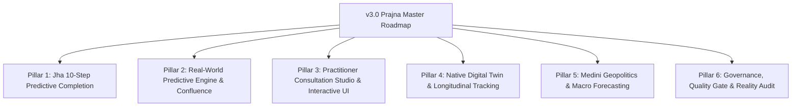

# AstroOS Phase V / v3.0.0 Master Roadmap & Architecture Blueprint

**Version:** `v3.0.0` — Phase V  
**Codename:** **"Prajna"** (*Transcendent Astrological Wisdom & Synthesis*)  
**Status:** **PROPOSED & ARCHITECTED (2026-09-01)**  
**Predecessor:** `v2.5.0` ("Jyotish Vidya") / `v2.4.0` ("Chandrika")  
**Architectural Mandate:** 100% Local-First, Zero Cloud Reliance, Shastric & Siddhantic Precision.

---

## 1. Executive Summary & Strategic Theme

AstroOS has successfully conquered foundational and classical calculation parity:
- **77 core calculation modules are frozen** with cryptographic hash verification (`FROZEN_MODULES.md`).
- **2,844 unit and integration tests** pass across KP, Jaimini, Tajika, Parashari, and Medini systems.
- **Local-first infrastructure** (FastAPI, Next.js 15, PostgreSQL, Local LLM via Ollama, P2P WebSocket collaboration) operates with zero cloud lock-in.

### The v3.0 "Prajna" Imperative:
**From Calculation Parity to Synthesized Predictive Intelligence.**

v3.0 unites our verified calculation foundations with **Vinay Jha's 10-Step Prediction Framework**, resolves the empirical validation gap through multi-domain real cohort benchmarks, and delivers a world-class **Practitioner Consultation Studio** with longitudinal life-simulation.

```
┌─────────────────────────────────────────────────────────────────────────────┐
│                    ASTROOS v3.0 "PRAJNA" ARCHITECTURE                       │
├─────────────────────────────────────────────────────────────────────────────┤
│  1. Jha 10-Step Predictive Engine   │  2. Real-World Validated MoE Engine   │
│     (MPC, Div-Vimshottari, Lifespan)│     (Multi-Domain Real Cohort Timing) │
├─────────────────────────────────────┼───────────────────────────────────────┤
│  3. Practitioner Consultation Studio│  4. Native Digital Twin Life Timeline │
│     (Live Transit Radar, Multi-Sync)│     (Event Logger, Adaptive BTR)      │
├─────────────────────────────────────┼───────────────────────────────────────┤
│  5. Medini & Macroeconomic Suite    │  6. Engineering & Governance Sync     │
│     (Kurma Geopolitics, Commodities)│     (IV.1 Audit, Version Sync v3.0)   │
└─────────────────────────────────────────────────────────────────────────────┘
```

---

## 2. The Six Strategic Pillars of Phase V (v3.0)



---

### Pillar 1: Vinay Jha 10-Step Predictive Sequence Completion

Fulfills all missing layers documented in `docs/JHA_PREDICTION_FRAMEWORK.md`:

1. **Masa Pravesha Chakra (MPC) Engine (Step 9):**
   - High-precision monthly solar return chart solver matching exact solar longitude increments ($30^\circ \times k$).
   - Patyayini and Mudda monthly dasha progression.
2. **Divisional Vimshottari Orchestration (Step 2 & Step 4):**
   - True independent 5-level Vimshottari computation per divisional chart ($D9, D10, D7, D4, D30, D12, D3$).
   - Integration with Final Varga Strength ($Main\ Strength \times Vimshopaka\ Weight$).
3. **Tri-Lifespan Mathematical Calculator (Step 3A):**
   - Classical triple lifespan computation (*Amshayu*, *Pindayu*, *Nisargayu*) with planetary reductions (*Harana* and *Bharana*).
   - Synthesis of Maraka lords ($2H, 7H, 6H, 8H, 12H$) with $D30$ Trishamsha affliction cross-checks.
4. **Kimshukadi Bhavottama Deep Analysis (Step 6):**
   - Rigorous same-bhava detection across D1, D9, D10, D30 with dignity compounding multipliers.

---

### Pillar 2: Real-World Predictive Engine & Confluence Calibration

Transitions the predictive AI from synthetic baselines to genuine statistical evidence:

1. **Multi-Domain Real Cohort Backtest Harness:**
   - Ingestion and normalization of multi-domain verified life events (Career Promotions, Marriage/Separation, Health Crises, Relocation, Childbirth).
   - Domain-stratified 4-fold expanding window walk-forward validation.
2. **Continuous Confluence Calibration:**
   - Replacing hard binary filters with smooth neural confluence features (Ashtakavarga score, Double Transit aspects, Dasha lord functional dignity).
   - Cost-sensitive threshold tuning for extreme low-prevalence event timing ($<2\%$ base rate).
3. **Leave-One-Subject-Out (LOSO) Robustness Testing:**
   - Elimination of single-subject concentration artifacts to ensure universal generalizability across diverse ascendants.

---

### Pillar 3: Practitioner Consultation Studio & Generative Visualizations

Elevating practitioner workflow with interactive, modern visual interfaces:

1. **Live Transit Sky-Clock & Radar:**
   - Dynamic real-time transit scrubber displaying current planetary movements superimposed against natal D1, D9, and Sarvatobhadra Chakra.
   - Real-time notification of exact degree hits on sensitive natal points, Arudha Lagna, and Bhrigu Bindu.
2. **Interactive Sudarshana Chakra Multi-Wheel:**
   - Concentric 3-ring circular visualization (Lagna, Chandra Lagna, Surya Lagna) with synchronized house alignment.
3. **Consultation Briefing Generator:**
   - 1-click practitioner dossier: active dasha themes, immediate transit triggers, strength balances, and classical shastric remedies.

---

### Pillar 4: Native Digital Twin & Longitudinal Life Tracker

1. **Continuous Native Life-Event Logging:**
   - Secure, encrypted local database for tracking subjective and objective life milestones over time.
2. **Adaptive Birth Time Rectification (BTR) Feedback Loop:**
   - Automatic refinement of birth time candidates based on backward-propagated event milestones using Tattva, Kunda, and KP SSL rules.
3. **Future Life-Horizon Simulation:**
   - 5-year and 10-year prospective window generation highlighting peak career, wealth, and health vulnerability periods.

---

### Pillar 5: Medini Geopolitics & Macroeconomic Forecasting Suite

1. **Kurma Chakra Subcontinent & Global Geopolitical Heatmaps:**
   - Interactive GIS overlay mapping planetary afflictions, eclipses, and ingresses onto regional coordinates.
2. **Monsoon & Seasonal Climate Modeling:**
   - 4-Pillar Medini synthesis integrating Chaitra Shukla Pratipada, Meru Mesha Ingress, Ardra Pravesha, and Sapta-Nadi Chakra wind/cloud vectors.
3. **Macro-Economic & Commodity Cycles:**
   - Planetary Cabinet (*Nava Nayakas*) economic indicators correlated with metals, agriculture, and market liquidity.

---

### Pillar 6: Governance, Quality Gate & Reality Audit (IV.1 Audit)

1. **IV.1 Reality vs Documentation Audit:**
   - Complete verification of all frozen modules against written architectural specifications.
2. **Version Synchronization:**
   - Reconciling `VERSION`, `pyproject.toml`, `package.json`, and `CLAUDE_START_HERE.md` to `v3.0.0`.
3. **Automated Continuous Regression & Benchmarking Pipeline:**
   - End-to-end precision checks enforcing zero numerical drift across Swiss Ephemeris and PyJHora test baselines.

---

## 3. Implementation Phasing & Milestones

| Milestone | Target Scope | Key Deliverables |
|---|---|---|
| **M1: Foundation & Audit** | Pillar 6 + Pillar 1 (Part 1) | IV.1 Reality Audit, VERSION sync to 3.0.0, Masa Pravesha (MPC) Engine |
| **M2: Shastric Completion** | Pillar 1 (Part 2) | Divisional Vimshottari, Tri-Lifespan Calculator, Bhavottama Engine |
| **M3: Empirical Validation** | Pillar 2 | Real Multi-Domain Cohort Benchmark, Confluence calibration, LOSO audit |
| **M4: Consultation Studio** | Pillar 3 | Interactive Sudarshana 3-Wheel, Live Transit Radar, Scrubber UI |
| **M5: Native Digital Twin** | Pillar 4 | Life Event Logger, Adaptive BTR Feedback, 10-Year Horizon Simulator |
| **M6: Medini & GA Release** | Pillar 5 + Release Freeze | Kurma Chakra GIS, Monsoon Engine, v3.0 Final Freeze & Certifications |

---

## 4. Verification & Siddhantic Compliance

All implementations within Phase V / v3.0 must adhere to:
- **AGENTS.md & Jyotisha Integrity Rules:** 7 Chara Karakas, Bhavachalita vs Rasi separation, Log-base-2 Main Strength as primary metric (Shadbala as tiebreaker only).
- **Zero Cloud Leakage:** All LLM prompts, embeddings, and data processing must remain strictly on-device/localhost.
- **Cryptographic Freezing:** Any newly certified core calculation engines must be added to `FROZEN_MODULES.md` with SHA-256 signatures.
